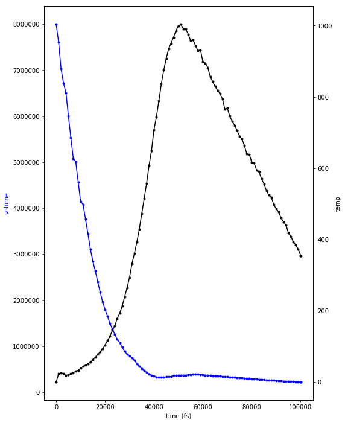
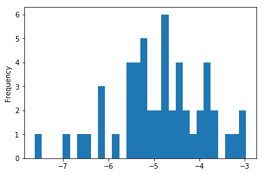

.. _P3HT_ET:
  
P3HT_ET
========================
 

In this example we run through a simplified procedure to calculate the
inter-molecular electronic coupling energies between
penta-3-hexylthiophene

Procedure::
    
    * Generate models of thiophene and hexane based on based on quantum chemistry data from NWChem
    * Use streamm to create a 3-hexylthiophene pentamer
    * Replicate the pentamer into a periodic simulation cell
    * Anneal the system with LAMMPS
    * Calculate the inter-molecular electronic coupling using NWChem’s electron transfer module

.. code:: python

    import os 
    from pprint import pprint

.. code:: python

    from pathlib2 import Path
    import os

.. code:: python

    import csv 

.. code:: python

    import numpy as np
    import decimal
    import copy

.. code:: python

    import matplotlib
    import matplotlib.pyplot as plt

.. code:: python

    %matplotlib inline

.. code:: python

    import time

Set wait time to check if calculation has finished

.. code:: python

    status_refresh = 1

.. code:: python

    import streamm

In this getting started example we will calculate the coupling between
P3HT oligomers

.. code:: python

    import logging
    logging.basicConfig(filename='p3ht_et.log',level=logging.DEBUG)

Load Resource objects from Resource example

.. code:: python

    need_files = ['local_res.json','remote_res.json']
    for f in need_files:
        path = Path(f)
        if not path.is_file():
            print("Need to run resource_example.ipynb")
            os.system("jupyter nbconvert --to python  resource_example.ipynb")
            os.system("python resource_example.py")

.. code:: python

    res_local = streamm.Resource('local')

The calc resource can be changed to local or remote host resouce

.. code:: python

    res_calc = streamm.Resource('remote')

.. code:: python

    res_local.import_json()
    res_calc.import_json()

Create needed directories

.. code:: python

    res_local.make_dir() 
    res_calc.make_dir() 

Now let’s create project and resource to keep track of our work

.. code:: python

    p3ht_et = streamm.Project('P3HT_ET')

Set the directory structure for the project

.. code:: python

    p3ht_et.set_resource(res_local)

Explicitly create a thiophene molecule

.. code:: python

    bbTh = streamm.Buildingblock('thiophene')
    symbols = ['C','C','C','C','S','H','H','H','H']
    positions = [ ]
    positions.append([-1.55498576,-1.91131218,-0.00081000])
    positions.append([-0.17775976,-1.91131218,-0.00081000])
    positions.append([0.34761524,-0.57904218,-0.00081000])
    positions.append([-0.65884476,0.36101082,0.00000000])
    positions.append([-2.16948076,-0.35614618,-0.00000800])
    positions.append([-2.18966076,-2.79526518,-0.00132100])
    positions.append([0.45389024,-2.80145418,-0.00106400])
    positions.append([1.41682424,-0.35961818,-0.00138200])
    positions.append([-0.51943676,1.44024682,0.00064700])
    for i in range(len(symbols)):
        pt_i = streamm.Particle(symbol=symbols[i])
        pos_i = positions[i]
        bbTh.add_partpos(pt_i,pos_i)

Set the names of the terminal sites to be joined later

.. code:: python

    bbTh.particles[5].rsite = 'termcap'
    bbTh.particles[6].rsite = 'funccap'
    bbTh.particles[8].rsite = 'termcap'

Set some properties of the molecule to keep track of the parts

.. code:: python

    c_cnt =1
    h_cnt =1
    
    for pkey_i, particle_i  in bbTh.particles.iteritems():
    
        if( particle_i.symbol == 'C' ):
            particle_i.label = "C%d"%(c_cnt)
            particle_i.resname = "SCP2"
            particle_i.residue = 1
    
            c_cnt +=1 
        if( particle_i.symbol == 'S' ):
            particle_i.resname = "ThS"
            particle_i.residue = 2
    
        if( particle_i.symbol == 'H' ):
            particle_i.label = "H%d"%(h_cnt)
            particle_i.resname = "HA"
            particle_i.residue = 3
    
            h_cnt +=1 

Set the force-field type and guess some reasonable charges

.. code:: python

    for pkey_i, particle_i  in bbTh.particles.iteritems():
        if( particle_i.symbol == 'C' ):
            particle_i.paramkey = 'CA'
            particle_i.charge = -0.025
        if( particle_i.symbol == 'S' ):
            particle_i.paramkey = 'S'
            particle_i.charge = -0.3
        if( particle_i.symbol == 'H' ):
            particle_i.paramkey = 'HA'
            particle_i.charge = 0.1

Check molecule is neutral

.. code:: python

    total_charge = 0.0
    for pkey_i, particle_i  in bbTh.particles.iteritems():
        total_charge += particle_i.charge
    print total_charge

.. parsed-literal::

    -2.77555756156e-17

Optimize structure with NWChem

But let’s put it in a function this time

.. code:: python

    def nw_opt(project_i,bb_i,res_i):
        '''Optimize a streamm Buildingblock object with nwchem 
        
        '''
        calc_n =  len(project_i.calculations)     
        nwchem_i = streamm.NWChem('nw_opt_{}_calc_{}'.format(bb_i.tag,calc_n))
        print nwchem_i.tag 
        # Add thiophene structure 
        nwchem_i.strucC = copy.deepcopy(bb_i)
        # Set calculation to run on external resource
        nwchem_i.set_resource(res_i)
        # Make the local directories 
        nwchem_i.make_dir()
        #Change to the `launch` directory
        os.chdir(nwchem_i.dir['launch'])
        # Copy over templates
        nwchem_i.cp_file('templates','run',"nwchem_remote.pbs",'templates','launch')
        nwchem_i.cp_file('templates','nw',"nwchem.nw",'templates','launch')
        # Read in templates files 
        nwchem_i.load_str('templates','nw')        
        nwchem_i.load_str('templates','run')
        # Set calculation properties 
        nwchem_i.properties['basis'] = '6-31g'
        nwchem_i.properties['method'] = 'UHF'
        nwchem_i.properties['charge'] = 0
        nwchem_i.properties['spin_mult'] = 1
        nwchem_i.properties['task'] = 'SCF optimize'
        nwchem_i.properties['coord'] = nwchem_i.strucC.write_coord()
        # 
        pprint(nwchem_i.properties)
        # Replace <key> with properties value 
        nwchem_i.replacewrite_prop('nw','input','nw','%s.nw'%(nwchem_i.tag))
        nwchem_i.properties['input_nw'] = nwchem_i.files['input']['nw']
        nwchem_i.replacewrite_prop('run','scripts','run','%s.pbs'%(nwchem_i.tag))
        #
        nwchem_i.add_file('output','log',"%s.log"%(nwchem_i.tag))
        # Save details in .json files 
        os.chdir(nwchem_i.dir['home'])
        p3ht_et.export_json()
        # 
        os.chdir(nwchem_i.dir['launch'])
        # 
        nwchem_i.push()
        # 
        nwchem_i.run()
        # Add calculation to project
        project_i.add_calc(nwchem_i,deepcopy = True)
        # 
        return project_i 

.. code:: python

    p3ht_et = nw_opt(p3ht_et,bbTh,res_calc)

.. parsed-literal::

    nw_opt_thiophene_calc_0
    {u'allocation': u'orgopv',
     u'basis': '6-31g',
     u'charge': 0,
     'comp_key': 'compressed',
     'compress': 'tar -czf ',
     'compress_sufix': 'tgz',
     'coord': u'     C      -1.55498576      -1.91131218      -0.00081000 \n     C      -0.17775976      -1.91131218      -0.00081000 \n     C       0.34761524      -0.57904218      -0.00081000 \n     C      -0.65884476       0.36101082       0.00000000 \n     S      -2.16948076      -0.35614618      -0.00000800 \n     H      -2.18966076      -2.79526518      -0.00132100 \n     H       0.45389024      -2.80145418      -0.00106400 \n     H       1.41682424      -0.35961818      -0.00138200 \n     H      -0.51943676       1.44024682       0.00064700 \n',
     u'e-mail': u'tkemper@nrel.gov',
     u'exe_command': u'qsub ',
     u'feature': u'24core',
     u'finish_str': u'Total times  cpu:',
     u'maxiter': 100,
     u'method': 'UHF',
     u'nodes': 1,
     u'nproc': 24,
     u'pmem': 1500,
     u'ppn': 24,
     u'queue': u'short',
     u'scratch': u'/scratch/tkemper/nw_opt_thiophene_calc_0/',
     u'spin_mult': 1,
     u'task': 'SCF optimize',
     'uncompress': 'tar -xzf ',
     u'walltime': 4}

.. code:: python

    nwchem_i = p3ht_et.calculations['nw_opt_thiophene_calc_0']

Check status unit finished

.. code:: python

    nwchem_i.check()
    print nwchem_i.meta['status'] 

.. parsed-literal::

    finished

.. code:: python

    while( nwchem_i.meta['status'] != 'finished'):
        nwchem_i.check()
        time.sleep(status_refresh)    

.. code:: python

    print nwchem_i.meta['status']

.. parsed-literal::

    finished

Store the results

.. code:: python

    nwchem_i.store()

Download full log file for analysis

.. code:: python

    nwchem_i.pull()

.. code:: python

    os.chdir(nwchem_i.dir['launch'])

.. code:: python

    nwchem_i.analysis()

Print energies, just for fun

.. code:: python

    print nwchem_i.properties['energy'],nwchem_i.unit_conf['energy']

.. parsed-literal::

    -551.190757406 Ha

Check that the positions of the structure have been optimized

.. code:: python

    print bbTh.positions

.. parsed-literal::

    [[ -1.55498576e+00  -1.91131218e+00  -8.10000000e-04]
     [ -1.77759760e-01  -1.91131218e+00  -8.10000000e-04]
     [  3.47615240e-01  -5.79042180e-01  -8.10000000e-04]
     [ -6.58844760e-01   3.61010820e-01   0.00000000e+00]
     [ -2.16948076e+00  -3.56146180e-01  -8.00000000e-06]
     [ -2.18966076e+00  -2.79526518e+00  -1.32100000e-03]
     [  4.53890240e-01  -2.80145418e+00  -1.06400000e-03]
     [  1.41682424e+00  -3.59618180e-01  -1.38200000e-03]
     [ -5.19436760e-01   1.44024682e+00   6.47000000e-04]]

.. code:: python

    bbTh.unit_conf['length']

.. parsed-literal::

    u'ang'

.. code:: python

    print nwchem_i.strucC.positions

.. parsed-literal::

    [[ -1.52905024e+00  -1.96222385e+00  -6.11050000e-04]
     [ -1.87311710e-01  -1.91419641e+00  -4.66760000e-04]
     [  3.42637680e-01  -5.70428160e-01   3.88200000e-05]
     [ -6.05117140e-01   3.80442720e-01   4.03810000e-04]
     [ -2.25044431e+00  -3.24165230e-01   1.68202000e-03]
     [ -2.16242498e+00  -2.82011122e+00  -2.84988000e-03]
     [  4.31099410e-01  -2.78806908e+00  -1.27520000e-03]
     [  1.39119019e+00  -3.53818160e-01  -6.53140000e-04]
     [ -4.82417750e-01   1.43967677e+00  -1.82662000e-03]]

.. code:: python

    nwchem_i.strucC.unit_conf['length']

.. parsed-literal::

    u'ang'

Update positions with optimized geometry

.. code:: python

    for pk,p in bbTh.particles.iteritems():
        bbTh.positions[pk] = nwchem_i.strucC.positions[pk]
        print pk,p.symbol,bbTh.positions[pk]

.. parsed-literal::

    0 C [ -1.52905024e+00  -1.96222385e+00  -6.11050000e-04]
    1 C [ -1.87311710e-01  -1.91419641e+00  -4.66760000e-04]
    2 C [  3.42637680e-01  -5.70428160e-01   3.88200000e-05]
    3 C [ -6.05117140e-01   3.80442720e-01   4.03810000e-04]
    4 S [ -2.25044431e+00  -3.24165230e-01   1.68202000e-03]
    5 H [-2.16242498 -2.82011122 -0.00284988]
    6 H [  4.31099410e-01  -2.78806908e+00  -1.27520000e-03]
    7 H [  1.39119019e+00  -3.53818160e-01  -6.53140000e-04]
    8 H [-0.48241775  1.43967677 -0.00182662]

Store the results in a tar ball in the storage directory

.. code:: python

    nwchem_i.store()

Now let us calculate the ESP charges to use in our forcefield

Again let’s make it a function

.. code:: python

    def nw_esp(project_i,bb_i,res_i):
        '''Calculate ESP charges of a streamm Buildingblock object with nwchem 
        
        '''
        calc_n =  len(project_i.calculations)     
        nwchem_esp = streamm.NWChem('nw_esp_{}_calc_{}'.format(bb_i.tag,calc_n))
        print(nwchem_esp.tag)
        # Add thiophene structure with optimized coordinates from previous calculation
        nwchem_esp.strucC = copy.deepcopy(bb_i)
        # Set calculation to run on external resource
        nwchem_esp.set_resource(res_i)
        # Add calculation to project
        project_i.add_calc(nwchem_esp)
        # Make the local directories 
        nwchem_esp.make_dir()
        # Change to the `launch` directory
        os.chdir(nwchem_esp.dir['launch'])
        #
        nwchem_esp.cp_file('templates','run',"nwchem_remote.pbs",'templates','launch')
        nwchem_esp.cp_file('templates','nw',"nwchem_esp.nw",'templates','launch')
        #
        nwchem_esp.load_str('templates','nw')        
        nwchem_esp.load_str('templates','run')
        # 
        nwchem_esp.properties['basis'] = '6-31g'
        nwchem_esp.properties['method'] = 'UHF'
        nwchem_esp.properties['charge'] = 0
        nwchem_esp.properties['spin_mult'] = 1
        nwchem_esp.properties['task'] = 'SCF'
        nwchem_esp.properties['coord'] = nwchem_esp.strucC.write_coord()
    
        pprint(nwchem_esp.properties)
    
        nwchem_esp.replacewrite_prop('nw','input','nw','%s.nw'%(nwchem_esp.tag))
    
        nwchem_esp.properties['input_nw'] = nwchem_esp.files['input']['nw']
        nwchem_esp.replacewrite_prop('run','scripts','run','%s.pbs'%(nwchem_esp.tag))
    
        nwchem_esp.add_file('output','log',"%s.log"%(nwchem_esp.tag))
    
        # Save details in .json files 
    
        os.chdir(nwchem_esp.dir['home'])
        nwchem_esp.export_json()
    
        os.chdir(nwchem_esp.dir['launch'])
        nwchem_esp.push()
        nwchem_esp.run()
        # Add calculation to project
        project_i.add_calc(nwchem_esp,deepcopy = True)
        # 
        return project_i 
        
        

.. code:: python

    p3ht_et = nw_esp(p3ht_et,bbTh,res_calc)

.. parsed-literal::

    nw_esp_thiophene_calc_1
    {u'allocation': u'orgopv',
     u'basis': '6-31g',
     u'charge': 0,
     'comp_key': 'compressed',
     'compress': 'tar -czf ',
     'compress_sufix': 'tgz',
     'coord': u'     C      -1.52905024      -1.96222385      -0.00061105 \n     C      -0.18731171      -1.91419641      -0.00046676 \n     C       0.34263768      -0.57042816       0.00003882 \n     C      -0.60511714       0.38044272       0.00040381 \n     S      -2.25044431      -0.32416523       0.00168202 \n     H      -2.16242498      -2.82011122      -0.00284988 \n     H       0.43109941      -2.78806908      -0.00127520 \n     H       1.39119019      -0.35381816      -0.00065314 \n     H      -0.48241775       1.43967677      -0.00182662 \n',
     u'e-mail': u'tkemper@nrel.gov',
     u'exe_command': u'qsub ',
     u'feature': u'24core',
     u'finish_str': u'Total times  cpu:',
     u'maxiter': 100,
     u'method': 'UHF',
     u'nodes': 1,
     u'nproc': 24,
     u'pmem': 1500,
     u'ppn': 24,
     u'queue': u'short',
     u'scratch': u'/scratch/tkemper/nw_esp_thiophene_calc_1/',
     u'spin_mult': 1,
     u'task': 'SCF',
     'uncompress': 'tar -xzf ',
     u'walltime': 4}

Check status until finished

.. code:: python

    p3ht_et.check()

.. parsed-literal::

    Calculation nw_esp_thiophene_calc_1 has status finished
    Calculation nw_opt_thiophene_calc_0 has status stored

.. code:: python

    nwchem_i = p3ht_et.calculations['nw_esp_thiophene_calc_1']

.. code:: python

    os.chdir(nwchem_i.dir['launch'])

.. code:: python

    while( nwchem_i.meta['status'] != 'finished'):
        nwchem_i.check()
        time.sleep(status_refresh)    

Store the results

.. code:: python

    nwchem_i.store()

Download full log file for analysis

.. code:: python

    nwchem_i.pull()

Run analysis to get the ESP charges

.. code:: python

    nwchem_i.analysis()

Check the new charges

.. code:: python

    for pk,p in nwchem_i.strucC.particles.iteritems():
        print p.symbol, p.charge

.. parsed-literal::

    C -0.086019
    C -0.136647
    C -0.085871
    C -0.108869
    S -0.117705
    H 0.153867
    H 0.118984
    H 0.109177
    H 0.153085

.. code:: python

    nwchem_i.strucC.calc_charge()
    print nwchem_i.strucC.charge

.. parsed-literal::

    2.00000000006e-06

A little extra charge can cause problems with our MD simulation so, if
our total is not zero let’s round and set to neutral

.. code:: python

    def charges_round_neutral(strucC,ndigits = 2 ):
        total_charge = 0.0 
        for pk,p in strucC.particles.iteritems():
            p.charge = round(p.charge,ndigits)
            total_charge += p.charge
        #
        print total_charge
        #
        for pk,p in strucC.particles.iteritems():
            p.charge += -1.0*total_charge/strucC.n_particles 
        strucC.calc_charge()
        #
        print strucC.charge

.. code:: python

    if( abs(nwchem_i.strucC.charge) > 1.0e-16 ):
        charges_round_neutral(nwchem_i.strucC)

.. parsed-literal::

    -0.02
    8.32667268469e-17

Update the charges of the Buildingblock

.. code:: python

    bbTh.tag += '_HFesp'

.. code:: python

    print bbTh.tag

.. parsed-literal::

    thiophene_HFesp

.. code:: python

    for pk,p in bbTh.particles.iteritems():
        p.charge = nwchem_i.strucC.particles[pk].charge
        print pk,p.symbol,p.charge

.. parsed-literal::

    0 C -0.0877777777778
    1 C -0.137777777778
    2 C -0.0877777777778
    3 C -0.107777777778
    4 S -0.117777777778
    5 H 0.152222222222
    6 H 0.122222222222
    7 H 0.112222222222
    8 H 0.152222222222

Create the neighbor list and use it to set the bonds, bond angles and
dihedrals for the force-field model

.. code:: python

    bbTh.bonded_nblist = bbTh.guess_nblist(0,radii_buffer=1.35)

.. code:: python

    bbTh.bonded_bonds()
    bbTh.bonded_angles()
    bbTh.bonded_dih()

Store an object of the Buildingblock

.. code:: python

    os.chdir(res_local.dir['materials']) 
    th_json = bbTh.export_json()

Let us optimize the structure with the oplsaa force-field to check the
parameters

.. code:: python

    os.chdir(res_local.dir['home']) 

.. code:: python

    need_files = ['oplsaa_param.json']
    for f in need_files:
        path = Path(f)
        if not path.is_file():
            print("Need to run forcefields_example.ipynb")
            os.system("jupyter nbconvert --to python  forcefields_example.ipynb")
            os.system("python forcefields_example.py")

.. code:: python

    oplsaa = streamm.Parameters('oplsaa')

.. code:: python

    oplsaa.import_json(read_file=True)

.. code:: python

    print oplsaa

.. parsed-literal::

    
        Parameters 
          LJ parameters 2 
          Bond parameters 2 
          Angle parameters 2 
          Dihedral parameters 1 
          Improper Dihedral parameters 0 
    

.. code:: python

    print oplsaa.unit_conf['energy']

.. parsed-literal::

    kCalmol

We need to add the conjugated carbons, hydrogen and sulfur atom types

.. code:: python

    import streamm.forcefields.particletype as particletype

.. code:: python

    import pymatgen_core.core.periodic_table as periodic_table

Set some parameters from J. Am. Chem. Soc., 1996, 118 (45), pp
11225–11236

.. code:: python

    CA = particletype.Particletype('CA')
    HA = particletype.Particletype('HA')

.. code:: python

    CA.update_units(oplsaa.unit_conf)
    HA.update_units(oplsaa.unit_conf)

.. code:: python

    CA.epsilon = 0.070 # kcal/mol
    CA.sigma = 3.55 # Angstroms 

.. code:: python

    HA.epsilon = 0.030 # kcal/mol
    HA.sigma = 2.42 # Angstroms 

.. code:: python

    CA.mass =  periodic_table.Element['C'].atomic_mass.real
    HA.mass =  periodic_table.Element['H'].atomic_mass.real

.. code:: python

    print CA,HA

.. parsed-literal::

     CA epsilon:0.07 sigma:3.55  HA epsilon:0.03 sigma:2.42

.. code:: python

    S = particletype.Particletype('S')

.. code:: python

    S.update_units(oplsaa.unit_conf)

Set some parameters from J. Am. Chem. Soc., 1996, 118 (45), pp
11225–11236

.. code:: python

    S.epsilon = 0.25 # kcal/mol
    S.sigma = 3.55 # Angstroms 

.. code:: python

    S.mass =  periodic_table.Element['S'].atomic_mass.real

Add to forcefield parameters container

.. code:: python

    oplsaa.add_particletype(CA)
    oplsaa.add_particletype(HA)
    oplsaa.add_particletype(S)

Set the bond stretching parameters

.. code:: python

    import streamm.forcefields.bondtype as bondtype

.. code:: python

    bt_i = bondtype.Bondtype('CA','HA',unit_conf=oplsaa.unit_conf)
    bt_i.setharmonic(1.080,367.0)
    oplsaa.add_bondtype(bt_i)

.. code:: python

    bt_i = bondtype.Bondtype('CA','CA',unit_conf=oplsaa.unit_conf)
    bt_i.setharmonic(1.400,469.0)
    oplsaa.add_bondtype(bt_i)

.. code:: python

    bt_i = bondtype.Bondtype('S','CA',unit_conf=oplsaa.unit_conf)
    bt_i.setharmonic(1.71,250.0)
    oplsaa.add_bondtype(bt_i)

.. code:: python

    for btk,bt in oplsaa.bondtypes.iteritems():
        print btk,bt

.. parsed-literal::

    0  bond  CT - HC type harmonic 
      harmonic r_0 = 1.080000 K = 367.000000 lammps index 0  gromacs index 0  
    1  bond  CT - CT type harmonic 
      harmonic r_0 = 1.530000 K = 268.000000 lammps index 0  gromacs index 0  
    2  bond  CA - HA type harmonic 
      harmonic r_0 = 1.080000 K = 367.000000 lammps index 0  gromacs index 0  
    3  bond  CA - CA type harmonic 
      harmonic r_0 = 1.400000 K = 469.000000 lammps index 0  gromacs index 0  
    4  bond  S - CA type harmonic 
      harmonic r_0 = 1.710000 K = 250.000000 lammps index 0  gromacs index 0  

.. code:: python

    import streamm.forcefields.angletype as angletype

.. code:: python

    bat_i = angletype.Angletype('CA','CA','CA',unit_conf=oplsaa.unit_conf)
    bat_i.setharmonic(120.0,63.0)
    oplsaa.add_angletype(bat_i)

.. code:: python

    bat_i = angletype.Angletype('CA','CA','HA',unit_conf=oplsaa.unit_conf)
    bat_i.setharmonic(120.0,35.0)
    oplsaa.add_angletype(bat_i)

.. code:: python

    bat_i = angletype.Angletype('CA','S','CA',unit_conf=oplsaa.unit_conf)
    bat_i.setharmonic(92.2,70.0)
    oplsaa.add_angletype(bat_i)

.. code:: python

    bat_i = angletype.Angletype('S','CA','HA',unit_conf=oplsaa.unit_conf)
    bat_i.setharmonic(120.0,35.0)
    oplsaa.add_angletype(bat_i)

.. code:: python

    bat_i = angletype.Angletype('S','CA','CA',unit_conf=oplsaa.unit_conf)
    bat_i.setharmonic(111.0,70.0)
    oplsaa.add_angletype(bat_i)

.. code:: python

    for atk,at in oplsaa.angletypes.iteritems():
        print atk,at

.. parsed-literal::

    0  angle  HC - CT - HC type harmonic 
      harmonic theta_0 = 110.700000 K = 37.500000 lammps index 0  gromacs index 0  
    1  angle  HC - CT - CT type harmonic 
      harmonic theta_0 = 110.700000 K = 37.500000 lammps index 0  gromacs index 0  
    2  angle  CA - CA - CA type harmonic 
      harmonic theta_0 = 120.000000 K = 63.000000 lammps index 0  gromacs index 0  
    3  angle  CA - CA - HA type harmonic 
      harmonic theta_0 = 120.000000 K = 35.000000 lammps index 0  gromacs index 0  
    4  angle  CA - S - CA type harmonic 
      harmonic theta_0 = 92.200000 K = 70.000000 lammps index 0  gromacs index 0  
    5  angle  S - CA - HA type harmonic 
      harmonic theta_0 = 120.000000 K = 35.000000 lammps index 0  gromacs index 0  
    6  angle  S - CA - CA type harmonic 
      harmonic theta_0 = 111.000000 K = 70.000000 lammps index 0  gromacs index 0  

Set some reasonable dihedral parameters

.. code:: python

    import streamm.forcefields.dihtype as dihtype

.. code:: python

    dih_i = dihtype.Dihtype('X','CA','CA','X',unit_conf=oplsaa.unit_conf)
    dih_i.type ='opls'
    dih_i.setopls(0.0,1.812532,0.0,0.0)
    oplsaa.add_dihtype(dih_i)

.. code:: python

    dih_i = dihtype.Dihtype('X','S','CA','X',unit_conf=oplsaa.unit_conf)
    dih_i.type ='opls'
    dih_i.setopls(0.0,2.416710,0.0,0.0)
    oplsaa.add_dihtype(dih_i)

.. code:: python

    dih_i = dihtype.Dihtype('S','CA','CA','HA',unit_conf=oplsaa.unit_conf)
    dih_i.type ='opls'
    dih_i.setopls(0.0,1.812532,0.0,0.0)
    oplsaa.add_dihtype(dih_i)

.. code:: python

    for dk,d in oplsaa.dihtypes.iteritems():
        print dk,d 

.. parsed-literal::

    0  dihedral  HC - CT - CT - HC type opls 
      k1 = 0.000000 k2 = 0.000000 k3 = 0.300000 k4 = 0.000000 lammps index 0  gromcas index 0 
    1  dihedral  X - CA - CA - X type opls 
      k1 = 0.000000 k2 = 1.812532 k3 = 0.000000 k4 = 0.000000 lammps index 0  gromcas index 0 
    2  dihedral  X - S - CA - X type opls 
      k1 = 0.000000 k2 = 2.416710 k3 = 0.000000 k4 = 0.000000 lammps index 0  gromcas index 0 
    3  dihedral  S - CA - CA - HA type opls 
      k1 = 0.000000 k2 = 1.812532 k3 = 0.000000 k4 = 0.000000 lammps index 0  gromcas index 0 

Let us make an MD simulation of just the monomer to check that our
parameters are okay

.. code:: python

    def lmp_run(project_i,bb_i,param_i,res_i,md_type = 'min'):
        # Create LAMMPS calculation object 
        calc_n =  len(project_i.calculations)     
        lmp_i = streamm.LAMMPS('lmp_{}_{}_calc_{}'.format(md_type,bb_i.tag,calc_n))
        # lmp_i = streamm.LAMMPS('lmp_{}_{}'.format(md_type,bb_i.tag))
        # Set parameter container 
        lmp_i.paramC = param_i
        lmp_i.set_strucC(bb_i)
        # Set force-field parameters 
        lmp_i.set_ffparam()
        # Set resource to local
        lmp_i.set_resource(res_i)
        # Make local directories
        lmp_i.make_dir()
        # Set pbc's to on
        lmp_i.strucC.lat.pbcs = [True,True,True]
        # Change to launch directory
        os.chdir(lmp_i.dir['launch'])
        # Copy over the templates from the template directory 
        lmp_i.cp_file('templates','in',"lammps_{}.in".format(md_type),'templates','launch')
        lmp_i.cp_file('templates','run',"lammps_remote.pbs",'templates','launch')
        # Change to scratch
        os.chdir(lmp_i.dir['launch'])
        # Read in template files and store them as strings in the `str` dictionary
        lmp_i.load_str('templates','in')
        lmp_i.load_str('templates','run')
        # Write LAMMPS .data file
        lmp_i.write_data()
        # Replace keys in template string with properties 
        lmp_i.replacewrite_prop('in','input','in','%s.in'%(lmp_i.tag))
        # Add the input file to the properties to be written into the run file
        lmp_i.properties['input_in'] = lmp_i.files['input']['in']
        lmp_i.replacewrite_prop('run','scripts','run','%s.pbs'%(lmp_i.tag))
        # Save json file in root directory
        os.chdir(lmp_i.dir['home'])
        lmp_i.export_json()
        # Run bash script or submit to cluster
        lmp_i.add_file('output','log',"%s.log"%(lmp_i.tag))
        # Save details in .json files 
        os.chdir(lmp_i.dir['home'])
        project_i.export_json()
        lmp_i.export_json()
        #
        os.chdir(lmp_i.dir['launch'])
        lmp_i.push()
        lmp_i.run()
        # Add calculation to project
        project_i.add_calc(lmp_i,deepcopy = True)
        # 
        return project_i     

.. code:: python

    p3ht_et.check()

.. parsed-literal::

    Calculation nw_esp_thiophene_calc_1 has status stored
    Calculation nw_opt_thiophene_calc_0 has status stored

.. code:: python

    p3ht_et = lmp_run(p3ht_et,bbTh,oplsaa,res_calc)

.. code:: python

    lmp_i = p3ht_et.calculations['lmp_min_thiophene_HFesp_calc_2']

.. code:: python

    os.chdir(lmp_i.dir['launch'])

.. code:: python

    while( lmp_i.meta['status'] != 'finished'):
        lmp_i.check()
        time.sleep(status_refresh)    

Run analysis of .in and .log files

.. code:: python

    lmp_i.analysis()

.. code:: python

    run_i= lmp_i.run_list[0]
    print run_i.timeseries['toteng']

.. parsed-literal::

    [15.543773, 7.7375745]

Energy decreased and nothing exploded so that’s good

.. code:: python

    lmp_i.store()

Read in data file positions

.. code:: python

    lmp_i.pull()

Read in data file output and update positions

.. code:: python

    datafn = lmp_i.files['output']['data_1']
    print datafn

.. parsed-literal::

    min1.data

.. code:: python

    lmp_i.read_data_pos(datafn)

.. code:: python

    print lmp_i.strucC.lat.matrix

.. parsed-literal::

    [[ 100.    0.    0.]
     [   0.  100.    0.]
     [   0.    0.  100.]]

.. code:: python

    lmp_i.strucC.write_xyz()

We will use the oplsaa optimized structure as the initial structure
since we will be running MD

.. code:: python

    bbTh.tag += '_oplsaa'

.. code:: python

    for pk,p in bbTh.particles.iteritems():
        bbTh.positions[pk] = lmp_i.strucC.positions[pk]
        print pk,p.symbol,bbTh.positions[pk]

.. parsed-literal::

    0 C [ -1.56860038e+00  -1.93713397e+00  -1.24273622e-03]
    1 C [ -1.72701660e-01  -1.89176169e+00  -1.60495164e-03]
    2 C [ 0.33787844 -0.59671672 -0.00115104]
    3 C [ -6.51342119e-01   3.89236583e-01  -4.03568474e-04]
    4 S [ -2.21162214e+00  -3.39574867e-01  -2.15216875e-04]
    5 H [ -2.16015039e+00  -2.84188201e+00  -1.58458414e-04]
    6 H [  4.46480869e-01  -2.77679556e+00  -1.26658112e-03]
    7 H [  1.39443300e+00  -3.72550668e-01  -5.03989719e-04]
    8 H [ -4.66214626e-01   1.45428691e+00   9.88545095e-04]

Save the Buildingblock and force-field

.. code:: python

    os.chdir(res_local.dir['materials']) 
    bbTh.write_xyz()
    th_json = bbTh.export_json() 
    oplsaa_json = oplsaa.export_json()

Okay now that we have a handle on thiophene let’s follow the same
procedure for hexane

Build hexane

.. code:: python

    bbHex = streamm.Buildingblock('hexane')
    symbols = ['C','H','H','H','C','H','H','C','H','H','C','H','H','C','H','H','C','H','H','H']
    positions = [ ]
    positions.append([-6.410969,-0.381641,-0.000031])
    positions.append([-7.310084,0.245311,-0.000038])
    positions.append([-6.456117,-1.028799,0.884636])
    positions.append([-6.456111,-1.028812,-0.884689])
    positions.append([-5.135268,0.467175,-0.000033])
    positions.append([-5.135484,1.128782,0.877977])
    positions.append([-5.135479,1.128771,-0.87805])
    positions.append([-3.850566,-0.371258,-0.000024])
    positions.append([-3.85112,-1.033978,0.87841])
    positions.append([-3.851114,-1.033987,-0.878451])
    positions.append([-2.567451,0.469603,-0.000024])
    positions.append([-2.567784,1.132155,0.8784])
    positions.append([-2.567776,1.132146,-0.878455])
    positions.append([-1.283527,-0.370234,-0.000013])
    positions.append([-1.28337,-1.032804,0.87836])
    positions.append([-1.28336,-1.032812,-0.87838])
    positions.append([0.00482234,0.47342231,-0.00000898])
    positions.append([0.02595107,1.09220686,0.87266464])
    positions.append([0.85585781,-0.17514133,0.00194589])
    positions.append([0.02780957,1.08937798,-0.87463473])
    for i in range(len(symbols)):
        pt_i = streamm.Particle(symbol=symbols[i])
        pos_i = positions[i]
        bbHex.add_partpos(pt_i,pos_i)

.. code:: python

    bbHex.particles[0].rsite = 'rg'
    bbHex.particles[1].rsite = 'rgcap'

.. code:: python

    c_cnt =1
    h_cnt =1
    for pkey_i, particle_i  in bbHex.particles.iteritems():
                if( particle_i.symbol == 'C' ):
                    particle_i.label = "C%d"%(c_cnt)
                    particle_i.resname = "SCP3"
                    particle_i.residue = c_cnt
                    c_cnt +=1 
                if( particle_i.symbol == 'H' ):
                    particle_i.label = "H%d"%(h_cnt)
                    particle_i.resname = "HC"
                    particle_i.residue = c_cnt -1 
                    h_cnt +=1 

Set the parameter keys and some reasonable atomic charges

.. code:: python

    for pkey_i, particle_i  in bbHex.particles.iteritems():
                if( particle_i.symbol == 'C' ):
                    particle_i.paramkey = 'CT'
                    particle_i.charge = -0.12
    
                if( particle_i.symbol == 'H' ):
                    particle_i.paramkey = 'HC'
                    particle_i.charge = 0.06
                print pkey_i, particle_i.symbol,particle_i.charge

.. parsed-literal::

    0 C -0.12
    1 H 0.06
    2 H 0.06
    3 H 0.06
    4 C -0.12
    5 H 0.06
    6 H 0.06
    7 C -0.12
    8 H 0.06
    9 H 0.06
    10 C -0.12
    11 H 0.06
    12 H 0.06
    13 C -0.12
    14 H 0.06
    15 H 0.06
    16 C -0.12
    17 H 0.06
    18 H 0.06
    19 H 0.06

.. code:: python

    bbHex.particles[0].charge  = -0.18
    bbHex.particles[16].charge  = -0.18

Check that the molecule is neutral

.. code:: python

    bbHex.calc_charge()
    print bbHex.charge

.. parsed-literal::

    0.0

Now let us optimize and calculate ESP charges for hexane

Optimize structure with NWChem

.. code:: python

    print p3ht_et.calculations.keys()

.. parsed-literal::

    ['lmp_min_thiophene_HFesp_calc_2', 'nw_esp_thiophene_calc_1', 'nw_opt_thiophene_calc_0']

.. code:: python

    p3ht_et = nw_opt(p3ht_et,bbHex,res_calc)

.. parsed-literal::

    nw_opt_hexane_calc_3
    {u'allocation': u'orgopv',
     u'basis': '6-31g',
     u'charge': 0,
     'comp_key': 'compressed',
     'compress': 'tar -czf ',
     'compress_sufix': 'tgz',
     'coord': u'     C      -6.41096900      -0.38164100      -0.00003100 \n     H      -7.31008400       0.24531100      -0.00003800 \n     H      -6.45611700      -1.02879900       0.88463600 \n     H      -6.45611100      -1.02881200      -0.88468900 \n     C      -5.13526800       0.46717500      -0.00003300 \n     H      -5.13548400       1.12878200       0.87797700 \n     H      -5.13547900       1.12877100      -0.87805000 \n     C      -3.85056600      -0.37125800      -0.00002400 \n     H      -3.85112000      -1.03397800       0.87841000 \n     H      -3.85111400      -1.03398700      -0.87845100 \n     C      -2.56745100       0.46960300      -0.00002400 \n     H      -2.56778400       1.13215500       0.87840000 \n     H      -2.56777600       1.13214600      -0.87845500 \n     C      -1.28352700      -0.37023400      -0.00001300 \n     H      -1.28337000      -1.03280400       0.87836000 \n     H      -1.28336000      -1.03281200      -0.87838000 \n     C       0.00482234       0.47342231      -0.00000898 \n     H       0.02595107       1.09220686       0.87266464 \n     H       0.85585781      -0.17514133       0.00194589 \n     H       0.02780957       1.08937798      -0.87463473 \n',
     u'e-mail': u'tkemper@nrel.gov',
     u'exe_command': u'qsub ',
     u'feature': u'24core',
     u'finish_str': u'Total times  cpu:',
     u'maxiter': 100,
     u'method': 'UHF',
     u'nodes': 1,
     u'nproc': 24,
     u'pmem': 1500,
     u'ppn': 24,
     u'queue': u'short',
     u'scratch': u'/scratch/tkemper/nw_opt_hexane_calc_3/',
     u'spin_mult': 1,
     u'task': 'SCF optimize',
     'uncompress': 'tar -xzf ',
     u'walltime': 4}

.. code:: python

    p3ht_et.check()

.. parsed-literal::

    Calculation nw_opt_hexane_calc_3 has status finished
    Calculation lmp_min_thiophene_HFesp_calc_2 has status stored
    Calculation nw_esp_thiophene_calc_1 has status stored
    Calculation nw_opt_thiophene_calc_0 has status stored

.. code:: python

    nwchem_i = p3ht_et.calculations['nw_opt_hexane_calc_3']

.. code:: python

    os.chdir(nwchem_i.dir['launch'])

.. code:: python

    while( nwchem_i.meta['status'] != 'finished'):
        nwchem_i.check()
        time.sleep(status_refresh)

Store the results

.. code:: python

    nwchem_i.store()

Download full log file for analysis

.. code:: python

    nwchem_i.pull()

Get the calculation from the project object

.. code:: python

    nwchem_i.analysis()

Print energies

.. code:: python

    print nwchem_i.properties['alpha_energies'][10:20]
    print nwchem_i.properties['energy']

.. parsed-literal::

    [-0.5549424, -0.5282407, -0.5218841, -0.4996812, -0.4774207, -0.4626707, -0.453462, -0.4506618, -0.4351213, 0.2272358]
    -235.271544596

Check that the positions of the structure have been optimized

.. code:: python

    for pk,p in bbHex.particles.iteritems():
        print pk,p.symbol,bbHex.positions[pk]

.. parsed-literal::

    0 C [ -6.41096900e+00  -3.81641000e-01  -3.10000000e-05]
    1 H [ -7.31008400e+00   2.45311000e-01  -3.80000000e-05]
    2 H [-6.456117 -1.028799  0.884636]
    3 H [-6.456111 -1.028812 -0.884689]
    4 C [ -5.13526800e+00   4.67175000e-01  -3.30000000e-05]
    5 H [-5.135484  1.128782  0.877977]
    6 H [-5.135479  1.128771 -0.87805 ]
    7 C [ -3.85056600e+00  -3.71258000e-01  -2.40000000e-05]
    8 H [-3.85112  -1.033978  0.87841 ]
    9 H [-3.851114 -1.033987 -0.878451]
    10 C [ -2.56745100e+00   4.69603000e-01  -2.40000000e-05]
    11 H [-2.567784  1.132155  0.8784  ]
    12 H [-2.567776  1.132146 -0.878455]
    13 C [ -1.28352700e+00  -3.70234000e-01  -1.30000000e-05]
    14 H [-1.28337  -1.032804  0.87836 ]
    15 H [-1.28336  -1.032812 -0.87838 ]
    16 C [  4.82234000e-03   4.73422310e-01  -8.98000000e-06]
    17 H [ 0.02595107  1.09220686  0.87266464]
    18 H [ 0.85585781 -0.17514133  0.00194589]
    19 H [ 0.02780957  1.08937798 -0.87463473]

.. code:: python

    print nwchem_i.strucC.positions

.. parsed-literal::

    [[ -6.40727096e+00  -3.79022800e-01   3.48200000e-05]
     [ -7.29437061e+00   2.44910680e-01   7.42400000e-05]
     [ -6.45166132e+00  -1.01740711e+00   8.76562180e-01]
     [ -6.45174258e+00  -1.01732205e+00  -8.76555670e-01]
     [ -5.13169157e+00   4.68167580e-01   1.40700000e-05]
     [ -5.13055152e+00   1.11968843e+00   8.70404110e-01]
     [ -5.13070047e+00   1.11990884e+00  -8.70210460e-01]
     [ -3.85233213e+00  -3.76683200e-01  -2.30580000e-04]
     [ -3.85428615e+00  -1.02883090e+00   8.70880960e-01]
     [ -3.85451311e+00  -1.02885462e+00  -8.71281400e-01]
     [ -2.57107059e+00   4.64329530e-01  -2.23200000e-04]
     [ -2.56902455e+00   1.11699819e+00   8.70459680e-01]
     [ -2.56884863e+00   1.11635486e+00  -8.71476170e-01]
     [ -1.29180043e+00  -3.80715820e-01   8.75000000e-06]
     [ -1.29320070e+00  -1.03207058e+00   8.70577760e-01]
     [ -1.29288445e+00  -1.03276930e+00  -8.69939160e-01]
     [ -1.54094200e-02   4.65275380e-01   1.41180000e-04]
     [  2.90437200e-02   1.10462404e+00   8.76019690e-01]
     [  8.70896720e-01  -1.59878970e-01   1.36176000e-03]
     [  3.02795500e-02   1.10278165e+00  -8.77060720e-01]]

Update positions in Buildingblock object

.. code:: python

    for pk,p in bbHex.particles.iteritems():
        bbHex.positions[pk] = nwchem_i.strucC.positions[pk]
        print pk,p.symbol,bbHex.positions[pk]

.. parsed-literal::

    0 C [ -6.40727096e+00  -3.79022800e-01   3.48200000e-05]
    1 H [ -7.29437061e+00   2.44910680e-01   7.42400000e-05]
    2 H [-6.45166132 -1.01740711  0.87656218]
    3 H [-6.45174258 -1.01732205 -0.87655567]
    4 C [ -5.13169157e+00   4.68167580e-01   1.40700000e-05]
    5 H [-5.13055152  1.11968843  0.87040411]
    6 H [-5.13070047  1.11990884 -0.87021046]
    7 C [ -3.85233213e+00  -3.76683200e-01  -2.30580000e-04]
    8 H [-3.85428615 -1.0288309   0.87088096]
    9 H [-3.85451311 -1.02885462 -0.8712814 ]
    10 C [ -2.57107059e+00   4.64329530e-01  -2.23200000e-04]
    11 H [-2.56902455  1.11699819  0.87045968]
    12 H [-2.56884863  1.11635486 -0.87147617]
    13 C [ -1.29180043e+00  -3.80715820e-01   8.75000000e-06]
    14 H [-1.2932007  -1.03207058  0.87057776]
    15 H [-1.29288445 -1.0327693  -0.86993916]
    16 C [ -1.54094200e-02   4.65275380e-01   1.41180000e-04]
    17 H [ 0.02904372  1.10462404  0.87601969]
    18 H [ 0.87089672 -0.15987897  0.00136176]
    19 H [ 0.03027955  1.10278165 -0.87706072]

Store the results in a tar ball in the storage directory

.. code:: python

    nwchem_i.store()

Now let us calculate the ESP charges to use in our forcefield

.. code:: python

    p3ht_et = nw_esp(p3ht_et,bbHex,res_calc)

.. parsed-literal::

    nw_esp_hexane_calc_4
    {u'allocation': u'orgopv',
     u'basis': '6-31g',
     u'charge': 0,
     'comp_key': 'compressed',
     'compress': 'tar -czf ',
     'compress_sufix': 'tgz',
     'coord': u'     C      -6.40727096      -0.37902280       0.00003482 \n     H      -7.29437061       0.24491068       0.00007424 \n     H      -6.45166132      -1.01740711       0.87656218 \n     H      -6.45174258      -1.01732205      -0.87655567 \n     C      -5.13169157       0.46816758       0.00001407 \n     H      -5.13055152       1.11968843       0.87040411 \n     H      -5.13070047       1.11990884      -0.87021046 \n     C      -3.85233213      -0.37668320      -0.00023058 \n     H      -3.85428615      -1.02883090       0.87088096 \n     H      -3.85451311      -1.02885462      -0.87128140 \n     C      -2.57107059       0.46432953      -0.00022320 \n     H      -2.56902455       1.11699819       0.87045968 \n     H      -2.56884863       1.11635486      -0.87147617 \n     C      -1.29180043      -0.38071582       0.00000875 \n     H      -1.29320070      -1.03207058       0.87057776 \n     H      -1.29288445      -1.03276930      -0.86993916 \n     C      -0.01540942       0.46527538       0.00014118 \n     H       0.02904372       1.10462404       0.87601969 \n     H       0.87089672      -0.15987897       0.00136176 \n     H       0.03027955       1.10278165      -0.87706072 \n',
     u'e-mail': u'tkemper@nrel.gov',
     u'exe_command': u'qsub ',
     u'feature': u'24core',
     u'finish_str': u'Total times  cpu:',
     u'maxiter': 100,
     u'method': 'UHF',
     u'nodes': 1,
     u'nproc': 24,
     u'pmem': 1500,
     u'ppn': 24,
     u'queue': u'short',
     u'scratch': u'/scratch/tkemper/nw_esp_hexane_calc_4/',
     u'spin_mult': 1,
     u'task': 'SCF',
     'uncompress': 'tar -xzf ',
     u'walltime': 4}

Check status unit finished

.. code:: python

    p3ht_et.check()

.. parsed-literal::

    Calculation nw_opt_hexane_calc_3 has status stored
    Calculation lmp_min_thiophene_HFesp_calc_2 has status stored
    Calculation nw_esp_thiophene_calc_1 has status stored
    Calculation nw_opt_thiophene_calc_0 has status stored
    Calculation nw_esp_hexane_calc_4 has status finished

.. code:: python

    nwchem_i = p3ht_et.calculations['nw_esp_hexane_calc_4']

.. code:: python

    os.chdir(nwchem_i.dir['launch'])

.. code:: python

    while( nwchem_i.meta['status'] != 'finished'):
        nwchem_i.check()
        time.sleep(status_refresh)

Store the results

.. code:: python

    nwchem_i.store()

Download full log file for analysis

.. code:: python

    nwchem_i.pull()

Get the calculation from the project object

.. code:: python

    nwchem_i.analysis()

Check the new charges

.. code:: python

    for pk,p in nwchem_i.strucC.particles.iteritems():
        print p.symbol, p.charge

.. parsed-literal::

    C -0.105244
    H 0.014521
    H 0.012033
    H 0.013511
    C 0.193579
    H -0.055571
    H -0.050708
    C 0.020885
    H -0.021868
    H -0.023513
    C 0.038327
    H -0.031259
    H -0.02887
    C 0.206295
    H -0.055744
    H -0.059999
    C -0.094196
    H 0.006375
    H 0.008327
    H 0.013119

.. code:: python

    nwchem_i.strucC.calc_charge()
    print nwchem_i.strucC.charge

.. parsed-literal::

    -1.38777878078e-17

Hum a little extra charge can cause problems with our MD simulation so
let’s round and set to neutral

.. code:: python

    if( abs(nwchem_i.strucC.charge) > 1.0e-16 ):
        charges_round_neutral(nwchem_i.strucC)

.. code:: python

    for pk,p in nwchem_i.strucC.particles.iteritems():
        print pk,p.symbol,p.charge

.. parsed-literal::

    0 C -0.105244
    1 H 0.014521
    2 H 0.012033
    3 H 0.013511
    4 C 0.193579
    5 H -0.055571
    6 H -0.050708
    7 C 0.020885
    8 H -0.021868
    9 H -0.023513
    10 C 0.038327
    11 H -0.031259
    12 H -0.02887
    13 C 0.206295
    14 H -0.055744
    15 H -0.059999
    16 C -0.094196
    17 H 0.006375
    18 H 0.008327
    19 H 0.013119

Print energies

.. code:: python

    print nwchem_i.properties['energy'],nwchem_i.unit_conf['energy']

.. parsed-literal::

    -235.271544664 Ha

Update the charges of the Buildingblock

.. code:: python

    for pk,p in bbHex.particles.iteritems():
        p.charge = nwchem_i.strucC.particles[pk].charge

.. code:: python

    bbHex.tag += '_HFesp'

First we need to identify the bonding within the Buildingblock

.. code:: python

    bbHex.bonded_nblist = bbHex.guess_nblist(0,radii_buffer=1.35)

.. code:: python

    bbHex.bonded_bonds()
    bbHex.bonded_angles()
    bbHex.bonded_dih()

Add the need parameters the oplsaa parameter container

.. code:: python

    bat_i = angletype.Angletype('CT','CT','CT',unit_conf=oplsaa.unit_conf)
    bat_i.setharmonic(109.50,40.0)
    oplsaa.add_angletype(bat_i)

.. code:: python

    bat_i = angletype.Angletype('CT','CT','CT',unit_conf=oplsaa.unit_conf)
    bat_i.setharmonic(109.50,40.0)
    oplsaa.add_angletype(bat_i)

.. code:: python

    bat_i = angletype.Angletype('CT','CT','HC',unit_conf=oplsaa.unit_conf)
    bat_i.setharmonic(109.50,50.0)
    oplsaa.add_angletype(bat_i)

.. code:: python

    dih_i = dihtype.Dihtype('CT','CT','CT','CT',unit_conf=oplsaa.unit_conf)
    dih_i.type ='opls'
    dih_i.setopls(0.433341,-0.016667,0.066668,0.0)
    oplsaa.add_dihtype(dih_i)

.. code:: python

    dih_i = dihtype.Dihtype('HC','CT','CT','CT',unit_conf=oplsaa.unit_conf)
    dih_i.type ='opls'
    dih_i.setopls(0.0,-0.0,0.1,0.0)
    oplsaa.add_dihtype(dih_i)

.. code:: python

    dih_i = dihtype.Dihtype('HC','CT','CT','HC',unit_conf=oplsaa.unit_conf)
    dih_i.type ='opls'
    dih_i.setopls(0.0,-0.0,0.1,0.0)
    oplsaa.add_dihtype(dih_i)

Run an oplsaa minimization to get the minimized structure

.. code:: python

    p3ht_et = lmp_run(p3ht_et,bbHex,oplsaa,res_calc)

.. code:: python

    p3ht_et.check()

.. parsed-literal::

    Calculation nw_opt_thiophene_calc_0 has status stored
    Calculation lmp_min_hexane_HFesp_calc_5 has status finished
    Calculation nw_opt_hexane_calc_3 has status stored
    Calculation nw_esp_hexane_calc_4 has status stored
    Calculation nw_esp_thiophene_calc_1 has status stored
    Calculation lmp_min_thiophene_HFesp_calc_2 has status stored

.. code:: python

    lmp_i = p3ht_et.calculations['lmp_min_hexane_HFesp_calc_5']

.. code:: python

    os.chdir(lmp_i.dir['launch'])

.. code:: python

    while( lmp_i.meta['status'] != 'finished'):
        lmp_i.check()
        time.sleep(status_refresh)

.. code:: python

    lmp_i.analysis()

.. code:: python

    run_i= lmp_i.run_list[0]
    print run_i.timeseries['toteng']

.. parsed-literal::

    [0.31363118, -2.1660767]

Energy decreased and nothing exploded so that’s good

.. code:: python

    lmp_i.store()

Read in data file positions

.. code:: python

    lmp_i.pull()

Read in data file output and update positions

.. code:: python

    datafn = lmp_i.files['output']['data_1']
    print datafn

.. parsed-literal::

    min1.data

.. code:: python

    lmp_i.read_data_pos(datafn)

.. code:: python

    print lmp_i.strucC.lat.matrix

.. parsed-literal::

    [[ 100.    0.    0.]
     [   0.  100.    0.]
     [   0.    0.  100.]]

.. code:: python

    lmp_i.strucC.write_xyz()

We will use the oplsaa optimized structure as the initial structure
since we will be running MD

.. code:: python

    bbHex.tag += '_oplsaa'

.. code:: python

    for pk,p in bbHex.particles.iteritems():
        bbHex.positions[pk] = lmp_i.strucC.positions[pk]
        print pk,p.symbol,bbHex.positions[pk]

.. parsed-literal::

    0 C [ -6.35048976e+00  -3.82441649e-01   4.02483375e-06]
    1 H [ -7.21782804e+00   2.61419707e-01   4.31417075e-05]
    2 H [-6.35480324 -1.00136556  0.88480962]
    3 H [-6.35483631 -1.00128616 -0.88490865]
    4 C [ -5.08921877e+00   4.86696511e-01  -5.13481611e-06]
    5 H [-5.08823242  1.10334127  0.88646294]
    6 H [-5.0882262   1.10356485 -0.88622022]
    7 C [ -3.83818177e+00  -3.97123139e-01  -8.20304824e-05]
    8 H [-3.83922579 -1.01367729  0.88658047]
    9 H [-3.83945824 -1.01372425 -0.88683773]
    10 C [ -2.58432257e+00   4.85509465e-01  -3.74340520e-04]
    11 H [-2.58237359  1.10232352  0.88624689]
    12 H [-2.58221249  1.10158735 -0.88739449]
    13 C [ -1.33454697e+00  -3.99747214e-01   2.01008037e-04]
    14 H [-1.3363286  -1.01619843  0.8867047 ]
    15 H [-1.33604794 -1.01675404 -0.88601173]
    16 C [ -7.27357978e-02   4.68476122e-01   8.17122773e-05]
    17 H [-0.06863501  1.08819196  0.88438197]
    18 H [ 0.79420855 -0.1758906   0.00117216]
    19 H [-0.06764303  1.08658157 -0.8852923 ]

Save the Buildingblock and force-field

.. code:: python

    os.chdir(res_local.dir['materials']) 
    bbHex.write_xyz()
    bbhex_json = bbHex.export_json() 
    oplsaa_json = oplsaa.export_json()

.. code:: python

    print bbHex.tag,bbTh.tag

.. parsed-literal::

    hexane_HFesp_oplsaa thiophene_HFesp_oplsaa

So let us make some P3HT oligomers

.. code:: python

    os.chdir(res_local.dir['materials']) 

.. code:: python

    bbTh.find_rsites()
    bbHex.find_rsites()

.. code:: python

    print(bbTh.show_rsites())

.. parsed-literal::

    rsite:termcap[ paticle:atom H1 (H) index:5 n_bonds:1] 
    rsite:termcap[ paticle:atom H4 (H) index:8 n_bonds:1] 
    rsite:funccap[ paticle:atom H2 (H) index:6 n_bonds:1] 
    

.. code:: python

    print(bbHex.show_rsites())

.. parsed-literal::

    rsite:rg[ paticle:atom C1 (C) index:0 n_bonds:4] 
    rsite:rgcap[ paticle:atom H1 (H) index:1 n_bonds:1] 
    

.. code:: python

    import streamm.structures.buildingblock as bb

.. code:: python

    ht = bb.attach(bbTh,bbHex,'funccap',0,'rgcap',0,tag='3-hexyl-thiophene')

Update bond angles and dihedrals after Buildingblock join

.. code:: python

    ht.bonded_bonds()
    ht.bonded_angles()
    ht.bonded_dih()

Check that the molecule looks good

.. code:: python

    ht.write_xyz()

Check the charges of the removed hydrogens got summed onto the
functionalized carbons correctly

.. code:: python

    ht.calc_charge()
    ht.charge

.. parsed-literal::

    4.163336342344337e-17

.. code:: python

    print(ht.show_rsites())

.. parsed-literal::

    rsite:termcap[ paticle:atom H1 (H) index:5 n_bonds:1] 
    rsite:termcap[ paticle:atom H4 (H) index:7 n_bonds:1] 
    rsite:rg[ paticle:atom C1 (C) index:8 n_bonds:4] 
    

Add inter thiophene hexane parameters

.. code:: python

    bt_i = bondtype.Bondtype('CT','CA',unit_conf=oplsaa.unit_conf)
    bt_i.setharmonic(1.51,317.0)
    oplsaa.add_bondtype(bt_i)

Bond angle parameters

.. code:: python

    bat_i = angletype.Angletype('CA','CA','CT',unit_conf=oplsaa.unit_conf)
    bat_i.setharmonic(120.0,70.0)
    oplsaa.add_angletype(bat_i)
    
    
    bat_i = angletype.Angletype('HA','CA','CT',unit_conf=oplsaa.unit_conf)
    bat_i.setharmonic(120.0,35.0)
    oplsaa.add_angletype(bat_i)
    
    
    
    bat_i = angletype.Angletype('CA','CT','HC',unit_conf=oplsaa.unit_conf)
    bat_i.setharmonic(109.5,50.0)
    oplsaa.add_angletype(bat_i)
    
    bat_i = angletype.Angletype('CA','CT','CT',unit_conf=oplsaa.unit_conf)
    bat_i.setharmonic(114.0,63.0)
    oplsaa.add_angletype(bat_i)

.. code:: python

    for atk,at in oplsaa.angletypes.iteritems():
        print atk,at

.. parsed-literal::

    0  angle  HC - CT - HC type harmonic 
      harmonic theta_0 = 110.700000 K = 37.500000 lammps index 0  gromacs index 0  
    1  angle  HC - CT - CT type harmonic 
      harmonic theta_0 = 110.700000 K = 37.500000 lammps index 0  gromacs index 0  
    2  angle  CA - CA - CA type harmonic 
      harmonic theta_0 = 120.000000 K = 63.000000 lammps index 0  gromacs index 0  
    3  angle  CA - CA - HA type harmonic 
      harmonic theta_0 = 120.000000 K = 35.000000 lammps index 0  gromacs index 0  
    4  angle  CA - S - CA type harmonic 
      harmonic theta_0 = 92.200000 K = 70.000000 lammps index 0  gromacs index 0  
    5  angle  S - CA - HA type harmonic 
      harmonic theta_0 = 120.000000 K = 35.000000 lammps index 0  gromacs index 0  
    6  angle  S - CA - CA type harmonic 
      harmonic theta_0 = 111.000000 K = 70.000000 lammps index 0  gromacs index 0  
    7  angle  CT - CT - CT type harmonic 
      harmonic theta_0 = 109.500000 K = 40.000000 lammps index 0  gromacs index 0  
    8  angle  CT - CT - CT type harmonic 
      harmonic theta_0 = 109.500000 K = 40.000000 lammps index 0  gromacs index 0  
    9  angle  CT - CT - HC type harmonic 
      harmonic theta_0 = 109.500000 K = 50.000000 lammps index 0  gromacs index 0  
    10  angle  CA - CA - CT type harmonic 
      harmonic theta_0 = 120.000000 K = 70.000000 lammps index 0  gromacs index 0  
    11  angle  HA - CA - CT type harmonic 
      harmonic theta_0 = 120.000000 K = 35.000000 lammps index 0  gromacs index 0  
    12  angle  CA - CT - HC type harmonic 
      harmonic theta_0 = 109.500000 K = 50.000000 lammps index 0  gromacs index 0  
    13  angle  CA - CT - CT type harmonic 
      harmonic theta_0 = 114.000000 K = 63.000000 lammps index 0  gromacs index 0  

Note: The inter-ring torsional is not consider as a separate set of
parameters for the simplicity of this example

.. code:: python

    dih_i = dihtype.Dihtype('HC','CT','CT','CA',unit_conf=oplsaa.unit_conf)
    dih_i.type ='opls'
    dih_i.setopls(0.0,-0.0,0.1,0.0)
    oplsaa.add_dihtype(dih_i)

.. code:: python

    dih_i = dihtype.Dihtype('CT','CT','CT','CA',unit_conf=oplsaa.unit_conf)
    dih_i.type ='opls'
    dih_i.setopls(0.433341,-0.016667,0.066668,0.0)
    oplsaa.add_dihtype(dih_i)

.. code:: python

    dih_i = dihtype.Dihtype('HC','CT','CA','CA',unit_conf=oplsaa.unit_conf)
    dih_i.type ='opls'
    dih_i.setopls(0.0,-0.0,0.1,0.0)
    oplsaa.add_dihtype(dih_i)

.. code:: python

    dih_i = dihtype.Dihtype('CT','CT','CA','CA',unit_conf=oplsaa.unit_conf)
    dih_i.type ='opls'
    dih_i.setopls(0.0,-0.0,0.0,0.0)
    oplsaa.add_dihtype(dih_i)

.. code:: python

    for dk,d in oplsaa.dihtypes.iteritems():
        print dk,d 

.. parsed-literal::

    0  dihedral  HC - CT - CT - HC type opls 
      k1 = 0.000000 k2 = 0.000000 k3 = 0.300000 k4 = 0.000000 lammps index 0  gromcas index 0 
    1  dihedral  X - CA - CA - X type opls 
      k1 = 0.000000 k2 = 1.812532 k3 = 0.000000 k4 = 0.000000 lammps index 0  gromcas index 0 
    2  dihedral  X - S - CA - X type opls 
      k1 = 0.000000 k2 = 2.416710 k3 = 0.000000 k4 = 0.000000 lammps index 0  gromcas index 0 
    3  dihedral  S - CA - CA - HA type opls 
      k1 = 0.000000 k2 = 1.812532 k3 = 0.000000 k4 = 0.000000 lammps index 0  gromcas index 0 
    4  dihedral  CT - CT - CT - CT type opls 
      k1 = 0.433341 k2 = -0.016667 k3 = 0.066668 k4 = 0.000000 lammps index 0  gromcas index 0 
    5  dihedral  HC - CT - CT - CT type opls 
      k1 = 0.000000 k2 = -0.000000 k3 = 0.100000 k4 = 0.000000 lammps index 0  gromcas index 0 
    6  dihedral  HC - CT - CT - HC type opls 
      k1 = 0.000000 k2 = -0.000000 k3 = 0.100000 k4 = 0.000000 lammps index 0  gromcas index 0 
    7  dihedral  HC - CT - CT - CA type opls 
      k1 = 0.000000 k2 = -0.000000 k3 = 0.100000 k4 = 0.000000 lammps index 0  gromcas index 0 
    8  dihedral  CT - CT - CT - CA type opls 
      k1 = 0.433341 k2 = -0.016667 k3 = 0.066668 k4 = 0.000000 lammps index 0  gromcas index 0 
    9  dihedral  HC - CT - CA - CA type opls 
      k1 = 0.000000 k2 = -0.000000 k3 = 0.100000 k4 = 0.000000 lammps index 0  gromcas index 0 
    10  dihedral  CT - CT - CA - CA type opls 
      k1 = 0.000000 k2 = -0.000000 k3 = 0.000000 k4 = 0.000000 lammps index 0  gromcas index 0 

Run an oplsaa minimization to get the minimized structure

.. code:: python

    p3ht_et = lmp_run(p3ht_et,ht,oplsaa,res_calc)

.. code:: python

    p3ht_et.check()

.. parsed-literal::

    Calculation nw_opt_thiophene_calc_0 has status stored
    Calculation lmp_min_hexane_HFesp_calc_5 has status stored
    Calculation nw_opt_hexane_calc_3 has status stored
    Calculation nw_esp_hexane_calc_4 has status stored
    Calculation nw_esp_thiophene_calc_1 has status stored
    Calculation lmp_min_3-hexyl-thiophene_calc_6 has status finished
    Calculation lmp_min_thiophene_HFesp_calc_2 has status stored

.. code:: python

    lmp_i = p3ht_et.calculations['lmp_min_3-hexyl-thiophene_calc_6']

.. code:: python

    os.chdir(lmp_i.dir['launch'])

.. code:: python

    while( lmp_i.meta['status'] != 'finished'):
        lmp_i.check()
        time.sleep(status_refresh)

.. code:: python

    lmp_i.analysis()

.. code:: python

    run_i= lmp_i.run_list[0]
    print run_i.timeseries['toteng']

.. parsed-literal::

    [21.641193, 7.4142365]

Energy decreased and nothing exploded so that’s good

.. code:: python

    lmp_i.store()

Read in data file positions

.. code:: python

    lmp_i.pull()

Read in data file output and update positions

.. code:: python

    datafn = lmp_i.files['output']['data_1']
    print datafn

.. parsed-literal::

    min1.data

.. code:: python

    lmp_i.read_data_pos(datafn)

.. code:: python

    print lmp_i.strucC.lat.matrix

.. parsed-literal::

    [[ 100.    0.    0.]
     [   0.  100.    0.]
     [   0.    0.  100.]]

We will use the oplsaa optimized structure as the initial structure
since we will be running MD

.. code:: python

    ht.tag += '_oplsaa'

.. code:: python

    for pk,p in ht.particles.iteritems():
        ht.positions[pk] = lmp_i.strucC.positions[pk]
        print pk,p.symbol,ht.positions[pk]

.. parsed-literal::

    0 C [  8.58370592e-01   1.19070471e+00  -5.28804768e-04]
    1 C [  1.40239117e-01  -7.00452375e-03  -1.10222324e-04]
    2 C [  9.47000345e-01  -1.14228366e+00  -3.01146622e-05]
    3 C [  2.31035453e+00  -8.47958093e-01  -5.72511231e-04]
    4 S [  2.54820509e+00   8.57941148e-01  -5.53636602e-04]
    5 H [  4.23475946e-01   2.17945621e+00   2.56365059e-05]
    6 H [  5.81335320e-01  -2.15847957e+00   1.66510611e-03]
    7 H [  3.09847213e+00  -1.58704244e+00   3.17623601e-04]
    8 C [ -1.37240779e+00  -4.91870618e-02  -3.14351461e-05]
    9 H [-1.73007996  0.46352867  0.87978503]
    10 H [-1.73012714  0.46373382 -0.87971024]
    11 C [ -1.94092528e+00  -1.46929147e+00  -2.38395321e-04]
    12 H [-1.60140899 -1.98442434  0.8858634 ]
    13 H [-1.60178525 -1.98398575 -0.88672554]
    14 C [ -3.46539204e+00  -1.45954947e+00  -2.12892073e-05]
    15 H [-3.82722062 -0.96572549  0.889898  ]
    16 H [-3.8274252  -0.96538471 -0.88966958]
    17 C [ -3.92038589e+00  -2.91914713e+00  -2.86128334e-04]
    18 H [-3.54855968 -3.41218649  0.8857171 ]
    19 H [-3.5492164  -3.41161563 -0.88688965]
    20 C [ -5.44494075e+00  -2.96276234e+00   3.02860353e-04]
    21 H [-5.81482214 -2.47201223  0.88764652]
    22 H [-5.81547674 -2.47166473 -0.88657923]
    23 C [ -5.90621381e+00  -4.42051223e+00   1.78831382e-04]
    24 H [-5.52564078 -4.91081232  0.88401194]
    25 H [ -6.98577456e+00  -4.44498633e+00   1.17673325e-03]
    26 H [-5.52727906 -4.91013854 -0.88473   ]

Save the Buildingblock and force-field

.. code:: python

    os.chdir(res_local.dir['materials']) 
    ht.write_xyz()
    ht_json = ht.export_json() 
    ht_json = oplsaa.export_json()

Okay we have the monomer, so let’s make a pentamer

.. code:: python

    penta_ht = copy.deepcopy(ht)

.. code:: python

    # We could use prepattach to change the tacticity 
    # penta_ht = ht.prepattach('termcap',0,dir=-1,yangle=180.0)
    # See buildingblock example 

.. code:: python

    for n in range(4):
        penta_ht = bb.attach(penta_ht,ht,'termcap',1,'termcap',0,tag='penta_3-hexyl-thiophene')

Check the charges of the removed hydrogens got summed onto the
functionalized carbons correctly

.. code:: python

    penta_ht.calc_charge()
    penta_ht.charge

.. parsed-literal::

    -1.3877787807814457e-17

.. code:: python

    penta_ht.write_xyz()

Well it’s cis, but we can run some high temperature MD to randomize that

Update bond angles and dihedrals after Buildingblock join

.. code:: python

    penta_ht.bonded_bonds()
    penta_ht.bonded_angles()
    penta_ht.bonded_dih()

.. code:: python

    print penta_ht.print_properties()

.. parsed-literal::

     n_particles:127 
     n_bonds:131
     n_angles:245
     n_dihedrals:351
     n_impropers:0

Run an oplsaa minimization to get the minimized structure

.. code:: python

    p3ht_et = lmp_run(p3ht_et,penta_ht,oplsaa,res_calc)

.. code:: python

    p3ht_et.check()

.. parsed-literal::

    Calculation nw_opt_thiophene_calc_0 has status stored
    Calculation lmp_min_hexane_HFesp_calc_5 has status stored
    Calculation nw_opt_hexane_calc_3 has status stored
    Calculation nw_esp_hexane_calc_4 has status stored
    Calculation nw_esp_thiophene_calc_1 has status stored
    Calculation lmp_min_3-hexyl-thiophene_calc_6 has status stored
    Calculation lmp_min_thiophene_HFesp_calc_2 has status stored
    Calculation lmp_min_penta_3-hexyl-thiophene_calc_7 has status finished

.. code:: python

    lmp_i = p3ht_et.calculations['lmp_min_penta_3-hexyl-thiophene_calc_7']

.. code:: python

    os.chdir(lmp_i.dir['launch'])

.. code:: python

    while( lmp_i.meta['status'] != 'finished'):
        lmp_i.check()
        time.sleep(status_refresh)

.. code:: python

    lmp_i.analysis()

.. code:: python

    run_i= lmp_i.run_list[0]
    print run_i.timeseries['toteng']

.. parsed-literal::

    [226.63649, 63.618098]

Energy decreased and nothing exploded so that’s good

.. code:: python

    lmp_i.store()

Read in data file positions

.. code:: python

    lmp_i.pull()

Read in data file output and update positions

.. code:: python

    datafn = lmp_i.files['output']['data_1']
    print datafn

.. parsed-literal::

    min1.data

.. code:: python

    lmp_i.read_data_pos(datafn)

.. code:: python

    print lmp_i.strucC.lat.matrix

.. parsed-literal::

    [[ 100.    0.    0.]
     [   0.  100.    0.]
     [   0.    0.  100.]]

.. code:: python

    lmp_i.strucC.write_xyz()

We will use the oplsaa optimized structure as the initial structure
since we will be running MD

.. code:: python

    penta_ht.tag += '_oplsaa'

.. code:: python

    for pk,p in penta_ht.particles.iteritems():
        penta_ht.positions[pk] = lmp_i.strucC.positions[pk]
        print pk,p.symbol,penta_ht.positions[pk]

.. parsed-literal::

    0 C [ 8.79936297 -9.45921163  0.04660658]
    1 C [ 10.02836293  -8.7841408    0.04809453]
    2 C [ 9.8801658  -7.41057561  0.03559302]
    3 C [ 8.56191665 -6.97604863  0.01129198]
    4 S [ 7.4831215  -8.31454927  0.04366329]
    5 H [  8.68225654 -10.53408948   0.05530629]
    6 H [ 10.72336387  -6.75917884   0.05175777]
    7 C [ 11.41176336  -9.42088438   0.06194701]
    8 H [ 11.50111713 -10.02939718   0.94851398]
    9 H [ 11.51394322 -10.0385352   -0.81688206]
    10 C [ 12.56067504  -8.38423411   0.06470721]
    11 H [ 12.4669048   -7.76519209   0.9450303 ]
    12 H [ 12.47833765  -7.77308813  -0.82225337]
    13 C [ 13.96450425  -8.98549442   0.07641092]
    14 H [ 14.09104427  -9.57752552   0.97022566]
    15 H [ 14.1024947   -9.58539125  -0.81044165]
    16 C [ 14.98212618  -7.83213      0.0778272 ]
    17 H [ 14.83915376  -7.22418119   0.95991337]
    18 H [ 14.8503908   -7.23199135  -0.81133642]
    19 C [ 16.40103152  -8.40625312   0.089386  ]
    20 H [ 16.53288467  -9.00382248   0.97887674]
    21 H [ 16.54424489  -9.01127831  -0.79328586]
    22 C [ 17.4353803   -7.27602923   0.09124402]
    23 H [ 17.29643001  -6.6674154    0.97233665]
    24 H [ 18.424169    -7.71042438   0.09960327]
    25 H [ 17.30800624  -6.67509906  -0.7968434 ]
    26 C [ 8.11872296 -5.63568566  0.04864692]
    27 C [ 8.91722627 -4.48455507  0.02952505]
    28 C [ 8.16615173 -3.33886755  0.01737829]
    29 C [ 6.78981537 -3.52800464  0.01326508]
    30 S [ 6.41834933 -5.22676952  0.02281556]
    31 H [ 8.66097911 -2.40233289  0.03066734]
    32 C [ 10.43280902  -4.38859399   0.04035463]
    33 H [ 10.7925421   -4.87147708   0.9349902 ]
    34 H [ 10.80572858  -4.87767278  -0.84552511]
    35 C [ 11.0232968   -2.97785466   0.03952752]
    36 H [ 10.70263303  -2.45120754   0.92706738]
    37 H [ 10.71333187  -2.45638725  -0.85487463]
    38 C [ 12.54436991  -3.07903852   0.04896882]
    39 H [ 12.86538508  -3.59714701   0.94086765]
    40 H [ 12.8762085   -3.60101769  -0.83669221]
    41 C [ 13.10791266  -1.65890093   0.04924013]
    42 H [ 12.76750029  -1.13978236   0.93352503]
    43 H [ 12.7778692   -1.14358819  -0.84119291]
    44 C [ 14.63345537  -1.72992489   0.05833036]
    45 H [ 14.96153606  -2.24535494   0.94900893]
    46 H [ 14.97188826  -2.24892823  -0.82638753]
    47 C [ 15.19349829  -0.30756625   0.05872544]
    48 H [ 14.84197547   0.20798324   0.93996533]
    49 H [ 16.27153974  -0.35725959   0.06526244]
    50 H [ 14.85251643   0.20431467  -0.82877083]
    51 C [ 5.8380009  -2.47955878  0.01969652]
    52 C [ 6.11366005 -1.09824382  0.01014747]
    53 C [  4.97794193e+00  -3.37400860e-01   1.23311589e-03]
    54 C [  3.78591905e+00  -1.04588863e+00  -2.30546230e-03]
    55 S [ 4.10956593 -2.76037036  0.01295562]
    56 H [ 5.06923086  0.71823224  0.01529283]
    57 C [ 7.46111776 -0.3968374   0.01939414]
    58 H [ 7.98112339 -0.69123563  0.91693331]
    59 H [ 7.99393057 -0.69322737 -0.86993837]
    60 C [ 7.45889886  1.13050931  0.01735118]
    61 H [ 6.96511992  1.4943474   0.9067923 ]
    62 H [ 6.97362048  1.49218317 -0.87764998]
    63 C [ 8.90833745  1.60518668  0.0238252 ]
    64 H [ 9.40238852  1.2457008   0.91472362]
    65 H [ 9.4105958   1.24502874 -0.86219397]
    66 C [ 8.89870635  3.13154334  0.02314122]
    67 H [ 8.38934539  3.4840631   0.90814688]
    68 H [ 8.39690778  3.48326686 -0.86649975]
    69 C [ 10.33729132   3.64391476   0.02906593]
    70 H [ 10.83932238   3.29423855   0.91930999]
    71 H [ 10.84681278   3.29354913  -0.85664812]
    72 C [ 10.30661332   5.1721166    0.02833372]
    73 H [ 9.78455775  5.51241791  0.91016652]
    74 H [ 11.32016207   5.54270832   0.03259643]
    75 H [ 9.79223645  5.51171574 -0.85826778]
    76 C [ 2.50346759 -0.44235404  0.0111463 ]
    77 C [  2.21083264e+00   9.37749289e-01   1.58080475e-03]
    78 C [ 0.86230685  1.19962199 -0.00321525]
    79 C [ 0.06404394  0.06729011 -0.00585907]
    80 S [ 1.03520404 -1.37849334  0.00332645]
    81 H [ 0.5029368   2.20285307  0.00340859]
    82 C [ 3.18573804  2.0995767   0.00580672]
    83 H [ 3.78136966  2.02878612  0.9028248 ]
    84 H [ 3.78903262  2.02904843 -0.88612638]
    85 C [  2.59546358e+00   3.50423970e+00   3.45763826e-03]
    86 H [ 2.00246626  3.65262477  0.89429482]
    87 H [ 2.00785594  3.65224259 -0.89102964]
    88 C [ 3.76028129  4.48878218  0.00680853]
    89 H [ 4.35598502  4.34515453  0.89666091]
    90 H [ 4.36025038  4.34616261 -0.88033333]
    91 C [ 3.16669821  5.8927604   0.00614376]
    92 H [ 2.56268928  6.02139934  0.8923271 ]
    93 H [ 2.5664826   6.02212726 -0.88251877]
    94 C [ 4.29470451  6.92036192  0.00901101]
    95 H [ 4.89424016  6.79454811  0.898762  ]
    96 H [ 4.89792506  6.79536919 -0.87837009]
    97 C [ 3.66395886  8.31196892  0.00833862]
    98 H [ 3.05120952  8.41815508  0.89106398]
    99 H [ 4.44839352  9.05273285  0.01044037]
    100 H [ 3.05508607  8.419042   -0.87695619]
    101 C [-1.34945992  0.04715631  0.00522892]
    102 C [ -2.26563691e+00   1.11668243e+00   1.11691114e-03]
    103 C [ -3.58844654e+00   6.83912737e-01   2.28654640e-03]
    104 C [ -3.70880914e+00  -7.09742193e-01   2.96178908e-03]
    105 S [ -2.15362564e+00  -1.46684651e+00   9.97058727e-04]
    106 H [-4.43991816  1.3483703   0.00461938]
    107 H [ -4.65207521e+00  -1.23624353e+00   4.64421137e-03]
    108 C [ -1.87229864e+00   2.58505428e+00   1.22042816e-03]
    109 H [-1.28460882  2.7591265   0.88973801]
    110 H [-1.28328135  2.75924536 -0.8863981 ]
    111 C [ -2.95662893e+00   3.65566277e+00   3.89024007e-04]
    112 H [-3.55802171  3.56902792  0.89315411]
    113 H [-3.55661734  3.56923612 -0.89335408]
    114 C [ -2.22192529e+00   5.00589389e+00   1.00291233e-03]
    115 H [-1.60639711  5.08658215  0.88559712]
    116 H [-1.60637248  5.08731304 -0.88350324]
    117 C [ -3.25398749e+00   6.13074830e+00   1.39240937e-03]
    118 H [-3.86379024  6.04343783  0.88768398]
    119 H [-3.86387112  6.04395721 -0.88490669]
    120 C [ -2.56992457e+00   7.49928587e+00   1.78520897e-03]
    121 H [-1.96376839  7.6044819   0.88984819]
    122 H [-1.96419106  7.60513368 -0.88649854]
    123 C [ -3.66421466e+00   8.56854716e+00   2.44126473e-03]
    124 H [-4.27271825  8.44581737  0.88611179]
    125 H [ -3.20630053e+00   9.54598548e+00   2.84824923e-03]
    126 H [-4.27295649  8.44664045 -0.88117706]

Save the Buildingblock and force-field

.. code:: python

    oplsaa.tag += '_p3ht'

.. code:: python

    os.chdir(res_local.dir['materials']) 
    penta_ht.write_xyz()
    penta_ht_json = penta_ht.export_json() 
    oplsaa_json = oplsaa.export_json()

Cool let’s run some MD

.. code:: python

    p3ht_et = lmp_run(p3ht_et,penta_ht,oplsaa,res_calc,md_type='nvt')

.. code:: python

    p3ht_et.check()

.. parsed-literal::

    Calculation nw_opt_thiophene_calc_0 has status stored
    Calculation lmp_min_hexane_HFesp_calc_5 has status stored
    Calculation nw_opt_hexane_calc_3 has status stored
    Calculation nw_esp_hexane_calc_4 has status stored
    Calculation nw_esp_thiophene_calc_1 has status stored
    Calculation lmp_min_3-hexyl-thiophene_calc_6 has status stored
    Calculation lmp_min_thiophene_HFesp_calc_2 has status stored
    Calculation lmp_nvt_penta_3-hexyl-thiophene_oplsaa_calc_8 has status finished
    Calculation lmp_min_penta_3-hexyl-thiophene_calc_7 has status stored

.. code:: python

    lmp_i = p3ht_et.calculations['lmp_nvt_penta_3-hexyl-thiophene_oplsaa_calc_8']

.. code:: python

    os.chdir(lmp_i.dir['launch'])

.. code:: python

    while( lmp_i.meta['status'] != 'finished'):
        lmp_i.check()
        time.sleep(status_refresh)

.. code:: python

    lmp_i.analysis()

.. code:: python

    run_i= lmp_i.run_list[0]
    print run_i.timeseries['toteng']

.. parsed-literal::

    [64.241056, 64.214967]

.. code:: python

    lmp_i.store()

Read in data file positions

.. code:: python

    lmp_i.pull()

Read in data file output and update positions

.. code:: python

    datafn = lmp_i.files['output']['data_3']
    print datafn

.. parsed-literal::

    min2.data

.. code:: python

    lmp_i.read_data_pos(datafn)

.. code:: python

    print lmp_i.strucC.lat.matrix

.. parsed-literal::

    [[ 100.    0.    0.]
     [   0.  100.    0.]
     [   0.    0.  100.]]

.. code:: python

    lmp_i.strucC.write_xyz()

Awesome! We have a randomized pentamer, so let’s save that as new
Buildingblock

.. code:: python

    bbPHTh_1 = copy.deepcopy(lmp_i.strucC)

.. code:: python

    print bbPHTh_1

.. parsed-literal::

     penta_3-hexyl-thiophene_oplsaa

.. code:: python

    print bbPHTh_1.n_particles

.. parsed-literal::

    127

.. code:: python

    os.chdir(p3ht_et.dir['home'])
    p3ht_et.export_json()

.. parsed-literal::

    {u'calculations': {'lmp_min_3-hexyl-thiophene_calc_6': u'lammps',
      'lmp_min_hexane_HFesp_calc_5': u'lammps',
      'lmp_min_penta_3-hexyl-thiophene_calc_7': u'lammps',
      'lmp_min_thiophene_HFesp_calc_2': u'lammps',
      'lmp_nvt_penta_3-hexyl-thiophene_oplsaa_calc_8': u'lammps',
      'nw_esp_hexane_calc_4': u'nwchem',
      'nw_esp_thiophene_calc_1': u'nwchem',
      'nw_opt_hexane_calc_3': u'nwchem',
      'nw_opt_thiophene_calc_0': u'nwchem'},
     u'meta': {'date': '2017-11-16T09:32:33.686736',
      'software': u'streamm_proj',
      'status': 'written'},
     u'resources': ['local']}

.. code:: python

    os.chdir(res_local.dir['materials']) 
    bbPHTh_1.write_xyz()
    bbPHTh_1_json = bbPHTh_1.export_json() 

Now let’s replicate the oligomer 50 times to create a low density system

Increase the box size

.. code:: python

    pHTh_x = streamm.Buildingblock()

.. code:: python

    def replicate(pHTh_x,bbPHTh_1,res_local):
        '''Replciate structure '''
        pHTh_x.lat.matrix = [ 200.,0.,0., 0.,200.,0.,  0.,0.,200.]
    
        pHTh_x.lat.pbcs = [False,False,False]
    
        seed = 394572
    
        # Randomly place oligomers into the simulation cell
    
        pHTh_x = streamm.add_struc(pHTh_x,bbPHTh_1,50,seed)
        pHTh_x.tag = 'p3HTx50'
        pHTh_x.lat.pbcs = [True,True,True]
    
        os.chdir(res_local.dir['materials']) 
        pHTh_x.write_xyz()
        pHTh_json = pHTh_x.export_json() 
        
        return pHTh_x

.. code:: python

    need_files = ['p3HTx50_struc.json']
    read_p3HTx50 = True 
    for f in need_files:
        path = Path(f)
        if not path.is_file():
            print("Need to run replicate")
             pHTh_x = replicate(pHTh_x,bbPHTh_1,res_local)
            read_p3HTx50 = False

.. code:: python

    if( read_p3HTx50 ):
        pHTh_x.tag = 'p3HTx50'
        pHTh_x.import_json()
        

.. code:: python

    print pHTh_x.n_particles
    print pHTh_x.lat.matrix

.. parsed-literal::

    6350
    [[ 200.    0.    0.]
     [   0.  200.    0.]
     [   0.    0.  200.]]

Check grouping

.. code:: python

    groupset_i = streamm.Groups('mol',pHTh_x)
    groupset_i.group_prop('mol','oligomers')

.. code:: python

    print len(groupset_i.groups)

.. parsed-literal::

    50

.. code:: python

    groupset_i.strucC.lat.pbcs

.. parsed-literal::

    [True, True, True]

Run a heat cool cycle with NPT to create a solid phase representation of
p3HT

.. code:: python

    p3ht_et = lmp_run(p3ht_et,pHTh_x,oplsaa,res_calc,md_type = 'equ0')

.. code:: python

    p3ht_et.check()

.. parsed-literal::

    Calculation nw_opt_thiophene_calc_0 has status stored
    Calculation lmp_min_hexane_HFesp_calc_5 has status stored
    Calculation nw_opt_hexane_calc_3 has status stored
    Calculation nw_esp_hexane_calc_4 has status stored
    Calculation nw_esp_thiophene_calc_1 has status stored
    Calculation lmp_min_3-hexyl-thiophene_calc_6 has status stored
    Calculation lmp_min_thiophene_HFesp_calc_2 has status stored
    Calculation lmp_nvt_penta_3-hexyl-thiophene_oplsaa_calc_8 has status stored
    Calculation lmp_min_penta_3-hexyl-thiophene_calc_7 has status stored
    Calculation lmp_equ0_p3HTx50_calc_9 has status finished

.. code:: python

    lmp_i = p3ht_et.calculations['lmp_equ0_p3HTx50_calc_9']

.. code:: python

    os.chdir(lmp_i.dir['launch'])

.. code:: python

    while( lmp_i.meta['status'] != 'finished'):
        lmp_i.check()
        time.sleep(status_refresh)

.. code:: python

    lmp_i.analysis()

Check how many runs there were in the output

.. code:: python

    print lmp_i.properties['run_cnt']

.. parsed-literal::

    3

Plot the time series data from the MD runs

.. code:: python

    def plot_mdrun(lmp_i):
    
    
        fig, ax = plt.subplots(1,sharey=True)
        ax2 = ax.twinx()
    
        for run_i in lmp_i.run_list:
            ax.plot(run_i.timeseries['step'],run_i.timeseries['volume'],'b.-')
            ax2.plot(run_i.timeseries['step'],run_i.timeseries['temp'],'k.-')
    
        ax.set_ylabel('volume', color='b')
        ax2.set_ylabel('temp', color='k')
        ax.set_xlabel('time (fs)', color='k')
    
    
        fig.subplots_adjust(hspace=0.0)   
        fig.set_size_inches(8.0, 12.0)
    
        fig.savefig('{}.pdf'.format(lmp_i.tag),format='pdf')
    

.. code:: python

    plot_mdrun(lmp_i)

Cool the volume is decreasing

Note:: If you want to collapse the system entirely you will have to run
a slower cooling cycle

.. code:: python

    lmp_i.store()

.. code:: python

    lmp_i.pull()

Read in data file output and update positions

.. code:: python

    datafn = lmp_i.files['output']['data_3']
    print datafn

.. parsed-literal::

    equ0.data

Update positions

.. code:: python

    lmp_i.read_data_pos(datafn)

Check the size of the simulation cell

.. code:: python

    print lmp_i.strucC.lat.matrix

.. parsed-literal::

    [[ 60.25290351   0.           0.        ]
     [  0.          60.25290351   0.        ]
     [  0.           0.          60.25290351]]

Update tag

.. code:: python

    lmp_i.strucC.tag += '_equ0'

.. code:: python

    lmp_i.strucC.write_xyz()

We can use streamm to calculate some properties of the system

.. code:: python

    lmp_i.strucC.calc_mass()
    lmp_i.strucC.calc_volume()
    lmp_i.strucC.calc_center_mass()

.. code:: python

    print lmp_i.strucC.center_mass

.. parsed-literal::

    [ 1.879089    3.80707676 -1.2714102 ]

.. code:: python

    struc_i = lmp_i.strucC

Save annealed structure

.. code:: python

    os.chdir(res_local.dir['materials'])
    struc_json = struc_i.export_json()

Let us create a new project to hold all the ET calculations we need to
do for each pair of groups

.. code:: python

    mol_et_equ0 = streamm.Project('mol_et_equ0')

.. code:: python

    mol_et_equ0.set_resource(res_local)

.. code:: python

    os.chdir(mol_et_equ0.dir['materials'])

If we need to restart the project here all we have to do is load in the
structure

.. code:: python

    try:
        print  struc_i.n_particles
    except:
        struc_i = streamm.Buildingblock('p3HTx50_equ0')
        struc_i.import_json()

.. parsed-literal::

    6350

Create groups out of the molecules

.. code:: python

    groupset_i = streamm.Groups('mol',struc_i)

.. code:: python

    groupset_i.group_prop('mol','oligomers')

.. code:: python

    print len(groupset_i.groups)

.. parsed-literal::

    50

.. code:: python

    groupset_i.strucC.lat.pbcs = [True,True,True]

.. code:: python

    print groupset_i.strucC.lat.pbcs

.. parsed-literal::

    [True, True, True]

.. code:: python

    print groupset_i.strucC.lat.matrix

.. parsed-literal::

    [[ 60.25290351   0.           0.        ]
     [  0.          60.25290351   0.        ]
     [  0.           0.          60.25290351]]

Apply periodic boundaries to all the groups, so the molecules are not
split across pbc’s

.. code:: python

    groupset_i.group_pbcs()

.. code:: python

    lmp_i.strucC.calc_center_mass()

.. code:: python

    print lmp_i.strucC.center_mass

.. parsed-literal::

    [ 3.00867262  4.93687616 -2.68781403]

Write out the new structure and check that all the molecules are whole

.. code:: python

    groupset_i.strucC.write_xyz('groups.xyz')

Calculate some group properties to use to build a neighbor list

.. code:: python

    groupset_i.calc_cent_mass()
    groupset_i.calc_radius()
    # groupset_i.calc_dl()

.. code:: python

    print groupset_i.strucC.lat
    print len(groupset_i.cent_mass)
    print len(groupset_i.radius)

.. parsed-literal::

    60.252904 0.000000 0.000000
    0.000000 60.252904 0.000000
    0.000000 0.000000 60.252904
    50
    50

Save the structure we are creating our pairs from

.. code:: python

    gmol_json = groupset_i.strucC.export_json()

Create a neighbor list of groups

.. code:: python

    groupset_i.group_nblist.radii_nblist(groupset_i.strucC.lat,groupset_i.cent_mass,groupset_i.radius,radii_buffer=0.500)

.. code:: python

    print groupset_i.group_nblist

.. parsed-literal::

     NBlist of 50 particles with 146 connections

.. code:: python

    g_nbs = []
    for gk_i,g_i in groupset_i.groups.iteritems():
            n_nbs = groupset_i.group_nblist.calc_nnab(gk_i)
            g_nbs.append(n_nbs)
    g_nbs = np.array(g_nbs)    

Check the min, average and max numbers of neighbors

.. code:: python

    print g_nbs.min(),g_nbs.mean(),g_nbs.max()

.. parsed-literal::

    0 2.92 5

Loop over each group, shift the group to the center of the simulation
cell and write an .xyz file that includes the neighbors of the group.

.. code:: python

    for gk_i,g_i in groupset_i.groups.iteritems():
            list_i = copy.deepcopy(g_i.pkeys)
            for g_j in groupset_i.group_nblist.getnbs(gk_i):
                list_i += groupset_i.groups[g_j].pkeys
            print gk_i,groupset_i.group_nblist.calc_nnab(gk_i),len(list_i)
            groupset_i.strucC.shift_pos(-1.0*g_i.cent_mass)  # Place center of mass at origin
            groupset_i.strucC.write_xyz_list(list_i,xyz_file='nn_{}.xyz'.format(gk_i))
            groupset_i.strucC.shift_pos(g_i.cent_mass)  # Return center of mass 
            
            list_i = []
            

.. parsed-literal::

    0 5 762
    1 4 635
    2 3 508
    3 3 508
    4 2 381
    5 4 635
    6 3 508
    7 4 635
    8 1 254
    9 2 381
    10 2 381
    11 4 635
    12 3 508
    13 1 254
    14 2 381
    15 2 381
    16 4 635
    17 4 635
    18 2 381
    19 2 381
    20 1 254
    21 1 254
    22 4 635
    23 4 635
    24 1 254
    25 3 508
    26 2 381
    27 4 635
    28 2 381
    29 4 635
    30 5 762
    31 3 508
    32 5 762
    33 3 508
    34 0 127
    35 2 381
    36 3 508
    37 3 508
    38 1 254
    39 4 635
    40 3 508
    41 3 508
    42 4 635
    43 2 381
    44 2 381
    45 4 635
    46 2 381
    47 5 762
    48 5 762
    49 4 635

The nearest neighbor cluster look good so let us calculate the electron
transfer

First create a list of unique pairs

.. code:: python

    et_pairs = {}
    et_pairs['i'] = []
    et_pairs['j'] = []
    for gk_i,g_i in groupset_i.groups.iteritems():
        for gk_j in groupset_i.group_nblist.getnbs(gk_i):
            if( gk_j > gk_i ):
                et_pairs['i'].append(gk_i)
                et_pairs['j'].append(gk_j)
                
                

Convert the dictionary to a pandas Dataframe

.. code:: python

    import pandas as pd

.. code:: python

    et_df = pd.DataFrame(et_pairs)

.. code:: python

    et_df.columns

.. parsed-literal::

    Index([], dtype='object')

Save that in a local file

.. code:: python

    et_fn = 'et_pairs.csv'
    if( len(et_df) == 0 ):
        et_df = pd.read_csv(et_fn)

.. code:: python

    print  len(et_df)

.. parsed-literal::

    71

.. code:: python

    et_df.to_csv('et_pairs.csv',sep=',')

.. code:: python

    def nw_et(project_i,res_i,groupset_i,gk_i,gk_j,run_calc = True):
    
        calc_n =  len(project_i.calculations)     
        nwchem_et = streamm.NWChem('nw_et_{}_g{}_g{}'.format(project_i.tag,gk_i,gk_j))
    
        # Set calculation to run on external resource
        nwchem_et.set_resource(res_i)
    
        # Make the local directories 
        nwchem_et.make_dir()
        # Change to the `launch` directory
        os.chdir(nwchem_et.dir['launch'])
    
        group_i = groupset_i.groups[gk_i]
        group_j = groupset_i.groups[gk_j]    
    
        nwchem_et.properties['coord_i'] = group_i.write_coord()
        nwchem_et.properties['coord_j'] = group_j.write_coord()    
        nwchem_et.properties['coord_ij'] = nwchem_et.properties['coord_i'] + nwchem_et.properties['coord_j'] 
        
        
    
        nwchem_et.cp_file('templates','run',"nwchem_remote.pbs",'templates','launch')
        nwchem_et.cp_file('templates','nw',"nwchem_et.nw",'templates','launch')
        #
        nwchem_et.load_str('templates','nw')        
        nwchem_et.load_str('templates','run')
        # 
        nwchem_et.replacewrite_prop('nw','input','nw','%s.nw'%(nwchem_et.tag))
    
        nwchem_et.properties['input_nw'] = nwchem_et.files['input']['nw']
        nwchem_et.replacewrite_prop('run','scripts','run','%s.pbs'%(nwchem_et.tag))
    
        nwchem_et.add_file('output','log',"%s.log"%(nwchem_et.tag))
        # Save details in .json files 
        # 
        os.chdir(nwchem_et.dir['home'])
        nwchem_et.export_json()
        # 
        #
        if( run_calc ):
            os.chdir(nwchem_et.dir['launch'])
            nwchem_et.push()
            nwchem_et.run()
            
        return nwchem_et

Loop over all the pairs and create NWChem ET input files

.. code:: python

    et_df['calc_id'] = None

.. code:: python

    for k,pair_i in et_df.iterrows():
        gk_i = pair_i['i']
        gk_j = pair_i['j']
        nwchem_et = nw_et(mol_et_equ0,res_calc,groupset_i,gk_i,gk_j,run_calc = False)
        # Add calculation to project
        mol_et_equ0.add_calc(nwchem_et,deepcopy = True)    
        # Add the tag to the Dataframe 
        #
        et_row = et_df.loc[ (et_df['i'] == gk_i ) & (et_df['j'] == gk_j)]
        et_index =  int(et_row.index[0])
        et_df.loc[et_index,'calc_id'] = nwchem_et.tag

Check the first couple of entries in the Dataframe

.. code:: python

    et_df.head()

.. raw:: html

    

    
    <table border="1" class="dataframe">
      <thead>
        <tr style="text-align: right;">
          <th></th>
          <th>Unnamed: 0</th>
          <th>i</th>
          <th>j</th>
          <th>calc_id</th>
        </tr>
      </thead>
      <tbody>
        <tr>
          <th>0</th>
          <td>0</td>
          <td>0</td>
          <td>3</td>
          <td>nw_et_mol_et_equ0_g0_g3</td>
        </tr>
        <tr>
          <th>1</th>
          <td>1</td>
          <td>0</td>
          <td>14</td>
          <td>nw_et_mol_et_equ0_g0_g14</td>
        </tr>
        <tr>
          <th>2</th>
          <td>2</td>
          <td>0</td>
          <td>15</td>
          <td>nw_et_mol_et_equ0_g0_g15</td>
        </tr>
        <tr>
          <th>3</th>
          <td>3</td>
          <td>0</td>
          <td>19</td>
          <td>nw_et_mol_et_equ0_g0_g19</td>
        </tr>
        <tr>
          <th>4</th>
          <td>4</td>
          <td>0</td>
          <td>43</td>
          <td>nw_et_mol_et_equ0_g0_g43</td>
        </tr>
      </tbody>
    </table>
    

.. code:: python

    os.chdir(mol_et_equ0.dir['home'])
    et_json = mol_et_equ0.export_json()

Now we have to wait for all of these calculations to finish

.. code:: python

    import sys 

.. code:: python

    calcsrunning = True 
    while( calcsrunning ):
        calcsrunning = False 
        n_running = 0 
        for k,calc_i in mol_et_equ0.calculations.iteritems():
            os.chdir(calc_i.dir['launch'])
            calc_i.check()
            if( calc_i.meta['status'] == 'finished' ):
                n_running += 1
            else:
                calcsrunning = True 
        sys.stdout.write("progress: {}/{} \r".format(n_running,len(mol_et_equ0.calculations)))
        sys.stdout.flush()
        time.sleep(status_refresh)

.. parsed-literal::

    progress: 71/71 

Run analysis on the results

S_ij is the Reactants/Products overlap between group i and group j and
V_ij is the Electron Transfer Coupling Energy between groups i and j.

.. code:: python

    et_df['S_ij'] = None
    et_df['S_ji'] = None
    et_df['V_ij'] = None
    et_df['V_ji'] = None

.. code:: python

    for k,calc_i in mol_et_equ0.calculations.iteritems():
        if(  calc_i.meta['status'] == 'finished' ):
    
            print calc_i.tag,calc_i.meta['status'] 
            os.chdir(calc_i.dir['launch'])
    
            et_row = et_df.loc[ et_df['calc_id'] == calc_i.tag ]
            
            et_index =  int(et_row.index[0])
            calc_i.store()
            calc_i.pull()
            calc_i.analysis()
    
            if( len(calc_i.et_list) > 0  ):
                et_df.loc[et_index,'S_ij'] = calc_i.et_list[0].S
                et_df.loc[et_index,'V_ij'] = calc_i.et_list[0].V
                et_df.loc[et_index,'S_ji'] = calc_i.et_list[1].S
                et_df.loc[et_index,'V_ji'] = calc_i.et_list[1].V
    
    
            calc_i.store()

.. parsed-literal::

    nw_et_mol_et_equ0_g14_g45 finished
    nw_et_mol_et_equ0_g10_g49 finished
    nw_et_mol_et_equ0_g43_g45 finished
    nw_et_mol_et_equ0_g12_g18 finished
    nw_et_mol_et_equ0_g1_g44 finished
    nw_et_mol_et_equ0_g8_g38 finished
    nw_et_mol_et_equ0_g9_g23 finished
    nw_et_mol_et_equ0_g39_g41 finished
    nw_et_mol_et_equ0_g0_g15 finished
    nw_et_mol_et_equ0_g0_g14 finished
    nw_et_mol_et_equ0_g38_g48 finished
    nw_et_mol_et_equ0_g0_g19 finished
    nw_et_mol_et_equ0_g14_g49 finished
    nw_et_mol_et_equ0_g20_g40 finished
    nw_et_mol_et_equ0_g0_g49 finished
    nw_et_mol_et_equ0_g23_g25 finished
    nw_et_mol_et_equ0_g7_g11 finished
    nw_et_mol_et_equ0_g3_g38 finished
    nw_et_mol_et_equ0_g15_g48 finished
    nw_et_mol_et_equ0_g4_g39 finished
    nw_et_mol_et_equ0_g4_g12 finished
    nw_et_mol_et_equ0_g37_g49 finished
    nw_et_mol_et_equ0_g0_g43 finished
    nw_et_mol_et_equ0_g6_g35 finished
    nw_et_mol_et_equ0_g1_g28 finished
    nw_et_mol_et_equ0_g10_g37 finished
    nw_et_mol_et_equ0_g10_g36 finished
    nw_et_mol_et_equ0_g32_g45 finished
    nw_et_mol_et_equ0_g36_g45 finished
    nw_et_mol_et_equ0_g36_g49 finished
    nw_et_mol_et_equ0_g26_g40 finished
    nw_et_mol_et_equ0_g0_g3 finished
    nw_et_mol_et_equ0_g2_g47 finished
    nw_et_mol_et_equ0_g24_g30 finished
    nw_et_mol_et_equ0_g14_g43 finished
    nw_et_mol_et_equ0_g35_g47 finished
    nw_et_mol_et_equ0_g12_g29 finished
    nw_et_mol_et_equ0_g34_g44 finished
    nw_et_mol_et_equ0_g14_g36 finished
    nw_et_mol_et_equ0_g12_g22 finished
    nw_et_mol_et_equ0_g17_g33 finished
    nw_et_mol_et_equ0_g15_g29 finished
    nw_et_mol_et_equ0_g15_g41 finished
    nw_et_mol_et_equ0_g36_g37 finished
    nw_et_mol_et_equ0_g9_g34 finished
    nw_et_mol_et_equ0_g18_g22 finished
    nw_et_mol_et_equ0_g6_g47 finished
    nw_et_mol_et_equ0_g16_g17 finished
    nw_et_mol_et_equ0_g24_g46 finished
    nw_et_mol_et_equ0_g24_g42 finished
    nw_et_mol_et_equ0_g19_g43 finished
    nw_et_mol_et_equ0_g13_g26 finished
    nw_et_mol_et_equ0_g8_g46 finished
    nw_et_mol_et_equ0_g23_g34 finished
    nw_et_mol_et_equ0_g7_g26 finished
    nw_et_mol_et_equ0_g2_g32 finished
    nw_et_mol_et_equ0_g2_g31 finished
    nw_et_mol_et_equ0_g7_g40 finished
    nw_et_mol_et_equ0_g44_g48 finished
    nw_et_mol_et_equ0_g44_g46 finished
    nw_et_mol_et_equ0_g5_g42 finished
    nw_et_mol_et_equ0_g5_g44 finished
    nw_et_mol_et_equ0_g22_g29 finished
    nw_et_mol_et_equ0_g5_g46 finished
    nw_et_mol_et_equ0_g1_g16 finished
    nw_et_mol_et_equ0_g1_g17 finished
    nw_et_mol_et_equ0_g1_g33 finished
    nw_et_mol_et_equ0_g10_g28 finished
    nw_et_mol_et_equ0_g14_g32 finished
    nw_et_mol_et_equ0_g34_g46 finished
    nw_et_mol_et_equ0_g5_g24 finished

Check the values in the Dataframe

.. code:: python

    et_df

.. raw:: html

    

    
    <table border="1" class="dataframe">
      <thead>
        <tr style="text-align: right;">
          <th></th>
          <th>Unnamed: 0</th>
          <th>i</th>
          <th>j</th>
          <th>calc_id</th>
          <th>S_ij</th>
          <th>S_ji</th>
          <th>V_ij</th>
          <th>V_ji</th>
        </tr>
      </thead>
      <tbody>
        <tr>
          <th>0</th>
          <td>0</td>
          <td>0</td>
          <td>3</td>
          <td>nw_et_mol_et_equ0_g0_g3</td>
          <td>4.73e-06</td>
          <td>4.73e-06</td>
          <td>1.396e-07</td>
          <td>1.396e-07</td>
        </tr>
        <tr>
          <th>1</th>
          <td>1</td>
          <td>0</td>
          <td>14</td>
          <td>nw_et_mol_et_equ0_g0_g14</td>
          <td>-1.09e-05</td>
          <td>-1.09e-05</td>
          <td>6.5729e-06</td>
          <td>6.5729e-06</td>
        </tr>
        <tr>
          <th>2</th>
          <td>2</td>
          <td>0</td>
          <td>15</td>
          <td>nw_et_mol_et_equ0_g0_g15</td>
          <td>-8.07e-06</td>
          <td>-8.07e-06</td>
          <td>4.211e-06</td>
          <td>4.211e-06</td>
        </tr>
        <tr>
          <th>3</th>
          <td>3</td>
          <td>0</td>
          <td>19</td>
          <td>nw_et_mol_et_equ0_g0_g19</td>
          <td>-3.32e-05</td>
          <td>-3.32e-05</td>
          <td>1.65649e-05</td>
          <td>1.65649e-05</td>
        </tr>
        <tr>
          <th>4</th>
          <td>4</td>
          <td>0</td>
          <td>43</td>
          <td>nw_et_mol_et_equ0_g0_g43</td>
          <td>0</td>
          <td>4.36e-19</td>
          <td>inf</td>
          <td>0.0310552</td>
        </tr>
        <tr>
          <th>5</th>
          <td>5</td>
          <td>0</td>
          <td>49</td>
          <td>nw_et_mol_et_equ0_g0_g49</td>
          <td>0</td>
          <td>1.04e-18</td>
          <td>NaN</td>
          <td>0.0260748</td>
        </tr>
        <tr>
          <th>6</th>
          <td>6</td>
          <td>1</td>
          <td>16</td>
          <td>nw_et_mol_et_equ0_g1_g16</td>
          <td>-0.000259</td>
          <td>-0.000259</td>
          <td>0.000202278</td>
          <td>0.000202278</td>
        </tr>
        <tr>
          <th>7</th>
          <td>7</td>
          <td>1</td>
          <td>17</td>
          <td>nw_et_mol_et_equ0_g1_g17</td>
          <td>0</td>
          <td>1.2e-19</td>
          <td>NaN</td>
          <td>0.113202</td>
        </tr>
        <tr>
          <th>8</th>
          <td>8</td>
          <td>1</td>
          <td>28</td>
          <td>nw_et_mol_et_equ0_g1_g28</td>
          <td>0</td>
          <td>-5.59e-20</td>
          <td>inf</td>
          <td>0</td>
        </tr>
        <tr>
          <th>9</th>
          <td>9</td>
          <td>1</td>
          <td>33</td>
          <td>nw_et_mol_et_equ0_g1_g33</td>
          <td>0</td>
          <td>1.05e-19</td>
          <td>NaN</td>
          <td>0</td>
        </tr>
        <tr>
          <th>10</th>
          <td>10</td>
          <td>1</td>
          <td>44</td>
          <td>nw_et_mol_et_equ0_g1_g44</td>
          <td>-4.64e-07</td>
          <td>-4.64e-07</td>
          <td>2.598e-07</td>
          <td>2.598e-07</td>
        </tr>
        <tr>
          <th>11</th>
          <td>11</td>
          <td>2</td>
          <td>31</td>
          <td>nw_et_mol_et_equ0_g2_g31</td>
          <td>4.43e-05</td>
          <td>4.43e-05</td>
          <td>9.7102e-06</td>
          <td>9.7102e-06</td>
        </tr>
        <tr>
          <th>12</th>
          <td>12</td>
          <td>2</td>
          <td>32</td>
          <td>nw_et_mol_et_equ0_g2_g32</td>
          <td>-2.39e-05</td>
          <td>-2.39e-05</td>
          <td>1.55469e-05</td>
          <td>1.55469e-05</td>
        </tr>
        <tr>
          <th>13</th>
          <td>13</td>
          <td>2</td>
          <td>47</td>
          <td>nw_et_mol_et_equ0_g2_g47</td>
          <td>9.57e-05</td>
          <td>9.57e-05</td>
          <td>4.7881e-05</td>
          <td>4.7881e-05</td>
        </tr>
        <tr>
          <th>14</th>
          <td>14</td>
          <td>3</td>
          <td>38</td>
          <td>nw_et_mol_et_equ0_g3_g38</td>
          <td>0</td>
          <td>-5.24e-20</td>
          <td>inf</td>
          <td>0.258692</td>
        </tr>
        <tr>
          <th>15</th>
          <td>15</td>
          <td>4</td>
          <td>12</td>
          <td>nw_et_mol_et_equ0_g4_g12</td>
          <td>-4.79e-05</td>
          <td>-4.79e-05</td>
          <td>3.43091e-05</td>
          <td>3.43091e-05</td>
        </tr>
        <tr>
          <th>16</th>
          <td>16</td>
          <td>4</td>
          <td>39</td>
          <td>nw_et_mol_et_equ0_g4_g39</td>
          <td>0.000229</td>
          <td>0.000229</td>
          <td>0.00013026</td>
          <td>0.00013026</td>
        </tr>
        <tr>
          <th>17</th>
          <td>17</td>
          <td>5</td>
          <td>24</td>
          <td>nw_et_mol_et_equ0_g5_g24</td>
          <td>0</td>
          <td>6.05e-20</td>
          <td>inf</td>
          <td>0.447933</td>
        </tr>
        <tr>
          <th>18</th>
          <td>18</td>
          <td>5</td>
          <td>42</td>
          <td>nw_et_mol_et_equ0_g5_g42</td>
          <td>0</td>
          <td>-5.31e-18</td>
          <td>inf</td>
          <td>0.00255317</td>
        </tr>
        <tr>
          <th>19</th>
          <td>19</td>
          <td>5</td>
          <td>44</td>
          <td>nw_et_mol_et_equ0_g5_g44</td>
          <td>-1.02e-05</td>
          <td>-1.02e-05</td>
          <td>4.4717e-06</td>
          <td>4.4717e-06</td>
        </tr>
        <tr>
          <th>20</th>
          <td>20</td>
          <td>5</td>
          <td>46</td>
          <td>nw_et_mol_et_equ0_g5_g46</td>
          <td>-4.94e-05</td>
          <td>-4.94e-05</td>
          <td>1.90377e-05</td>
          <td>1.90377e-05</td>
        </tr>
        <tr>
          <th>21</th>
          <td>21</td>
          <td>6</td>
          <td>35</td>
          <td>nw_et_mol_et_equ0_g6_g35</td>
          <td>0</td>
          <td>-3.13e-20</td>
          <td>inf</td>
          <td>0.433407</td>
        </tr>
        <tr>
          <th>22</th>
          <td>22</td>
          <td>6</td>
          <td>47</td>
          <td>nw_et_mol_et_equ0_g6_g47</td>
          <td>0.00189</td>
          <td>0.00189</td>
          <td>0.000967122</td>
          <td>0.000967122</td>
        </tr>
        <tr>
          <th>23</th>
          <td>23</td>
          <td>7</td>
          <td>11</td>
          <td>nw_et_mol_et_equ0_g7_g11</td>
          <td>0</td>
          <td>-3.06e-20</td>
          <td>NaN</td>
          <td>1.32665</td>
        </tr>
        <tr>
          <th>24</th>
          <td>24</td>
          <td>7</td>
          <td>26</td>
          <td>nw_et_mol_et_equ0_g7_g26</td>
          <td>0</td>
          <td>-4.29e-19</td>
          <td>NaN</td>
          <td>0</td>
        </tr>
        <tr>
          <th>25</th>
          <td>25</td>
          <td>7</td>
          <td>40</td>
          <td>nw_et_mol_et_equ0_g7_g40</td>
          <td>0</td>
          <td>1.31e-19</td>
          <td>inf</td>
          <td>0.103136</td>
        </tr>
        <tr>
          <th>26</th>
          <td>26</td>
          <td>8</td>
          <td>38</td>
          <td>nw_et_mol_et_equ0_g8_g38</td>
          <td>-5.69e-06</td>
          <td>-5.69e-06</td>
          <td>2.6111e-06</td>
          <td>2.6111e-06</td>
        </tr>
        <tr>
          <th>27</th>
          <td>27</td>
          <td>8</td>
          <td>46</td>
          <td>nw_et_mol_et_equ0_g8_g46</td>
          <td>4.41e-05</td>
          <td>4.41e-05</td>
          <td>1.59946e-05</td>
          <td>1.59946e-05</td>
        </tr>
        <tr>
          <th>28</th>
          <td>28</td>
          <td>9</td>
          <td>23</td>
          <td>nw_et_mol_et_equ0_g9_g23</td>
          <td>-0.000983</td>
          <td>-0.000983</td>
          <td>0.000494183</td>
          <td>0.000494183</td>
        </tr>
        <tr>
          <th>29</th>
          <td>29</td>
          <td>9</td>
          <td>34</td>
          <td>nw_et_mol_et_equ0_g9_g34</td>
          <td>1e-06</td>
          <td>1e-06</td>
          <td>8.349e-07</td>
          <td>8.349e-07</td>
        </tr>
        <tr>
          <th>...</th>
          <td>...</td>
          <td>...</td>
          <td>...</td>
          <td>...</td>
          <td>...</td>
          <td>...</td>
          <td>...</td>
          <td>...</td>
        </tr>
        <tr>
          <th>41</th>
          <td>41</td>
          <td>14</td>
          <td>45</td>
          <td>nw_et_mol_et_equ0_g14_g45</td>
          <td>-0.000222</td>
          <td>-0.000222</td>
          <td>0.000120298</td>
          <td>0.000120298</td>
        </tr>
        <tr>
          <th>42</th>
          <td>42</td>
          <td>14</td>
          <td>49</td>
          <td>nw_et_mol_et_equ0_g14_g49</td>
          <td>-4.69e-06</td>
          <td>-4.69e-06</td>
          <td>3.1552e-06</td>
          <td>3.1552e-06</td>
        </tr>
        <tr>
          <th>43</th>
          <td>43</td>
          <td>15</td>
          <td>29</td>
          <td>nw_et_mol_et_equ0_g15_g29</td>
          <td>-7.13e-05</td>
          <td>-7.13e-05</td>
          <td>4.08655e-05</td>
          <td>4.08655e-05</td>
        </tr>
        <tr>
          <th>44</th>
          <td>44</td>
          <td>15</td>
          <td>41</td>
          <td>nw_et_mol_et_equ0_g15_g41</td>
          <td>0.000171</td>
          <td>0.000171</td>
          <td>0.000127369</td>
          <td>0.000127369</td>
        </tr>
        <tr>
          <th>45</th>
          <td>45</td>
          <td>15</td>
          <td>48</td>
          <td>nw_et_mol_et_equ0_g15_g48</td>
          <td>8.21e-06</td>
          <td>8.21e-06</td>
          <td>6.44e-07</td>
          <td>6.44e-07</td>
        </tr>
        <tr>
          <th>46</th>
          <td>46</td>
          <td>16</td>
          <td>17</td>
          <td>nw_et_mol_et_equ0_g16_g17</td>
          <td>0</td>
          <td>1.61e-19</td>
          <td>inf</td>
          <td>0.168439</td>
        </tr>
        <tr>
          <th>47</th>
          <td>47</td>
          <td>17</td>
          <td>33</td>
          <td>nw_et_mol_et_equ0_g17_g33</td>
          <td>-0.000139</td>
          <td>-0.000139</td>
          <td>8.77301e-05</td>
          <td>8.77301e-05</td>
        </tr>
        <tr>
          <th>48</th>
          <td>48</td>
          <td>18</td>
          <td>22</td>
          <td>nw_et_mol_et_equ0_g18_g22</td>
          <td>0.000345</td>
          <td>0.000345</td>
          <td>0.000182499</td>
          <td>0.000182499</td>
        </tr>
        <tr>
          <th>49</th>
          <td>49</td>
          <td>19</td>
          <td>43</td>
          <td>nw_et_mol_et_equ0_g19_g43</td>
          <td>0</td>
          <td>8.73e-19</td>
          <td>NaN</td>
          <td>0</td>
        </tr>
        <tr>
          <th>50</th>
          <td>50</td>
          <td>20</td>
          <td>40</td>
          <td>nw_et_mol_et_equ0_g20_g40</td>
          <td>4.68e-05</td>
          <td>4.68e-05</td>
          <td>2.93207e-05</td>
          <td>2.93207e-05</td>
        </tr>
        <tr>
          <th>51</th>
          <td>51</td>
          <td>22</td>
          <td>29</td>
          <td>nw_et_mol_et_equ0_g22_g29</td>
          <td>-1.34e-05</td>
          <td>-1.34e-05</td>
          <td>6.6355e-06</td>
          <td>6.6355e-06</td>
        </tr>
        <tr>
          <th>52</th>
          <td>52</td>
          <td>23</td>
          <td>25</td>
          <td>nw_et_mol_et_equ0_g23_g25</td>
          <td>0.000114</td>
          <td>0.000114</td>
          <td>5.903e-05</td>
          <td>5.903e-05</td>
        </tr>
        <tr>
          <th>53</th>
          <td>53</td>
          <td>23</td>
          <td>34</td>
          <td>nw_et_mol_et_equ0_g23_g34</td>
          <td>-4.21e-06</td>
          <td>-4.21e-06</td>
          <td>4.9219e-06</td>
          <td>4.9219e-06</td>
        </tr>
        <tr>
          <th>54</th>
          <td>54</td>
          <td>24</td>
          <td>30</td>
          <td>nw_et_mol_et_equ0_g24_g30</td>
          <td>0</td>
          <td>-1.08e-18</td>
          <td>inf</td>
          <td>0.0250931</td>
        </tr>
        <tr>
          <th>55</th>
          <td>55</td>
          <td>24</td>
          <td>42</td>
          <td>nw_et_mol_et_equ0_g24_g42</td>
          <td>0.000246</td>
          <td>0.000246</td>
          <td>0.000130788</td>
          <td>0.000130788</td>
        </tr>
        <tr>
          <th>56</th>
          <td>56</td>
          <td>24</td>
          <td>46</td>
          <td>nw_et_mol_et_equ0_g24_g46</td>
          <td>0</td>
          <td>2.75e-20</td>
          <td>inf</td>
          <td>0.986066</td>
        </tr>
        <tr>
          <th>57</th>
          <td>57</td>
          <td>26</td>
          <td>40</td>
          <td>nw_et_mol_et_equ0_g26_g40</td>
          <td>-1.26e-05</td>
          <td>-1.26e-05</td>
          <td>2.8575e-06</td>
          <td>2.8575e-06</td>
        </tr>
        <tr>
          <th>58</th>
          <td>58</td>
          <td>32</td>
          <td>45</td>
          <td>nw_et_mol_et_equ0_g32_g45</td>
          <td>-0.00114</td>
          <td>-0.00114</td>
          <td>0.000645352</td>
          <td>0.000645352</td>
        </tr>
        <tr>
          <th>59</th>
          <td>59</td>
          <td>34</td>
          <td>44</td>
          <td>nw_et_mol_et_equ0_g34_g44</td>
          <td>-4.31e-07</td>
          <td>-4.31e-07</td>
          <td>8.281e-07</td>
          <td>8.281e-07</td>
        </tr>
        <tr>
          <th>60</th>
          <td>60</td>
          <td>34</td>
          <td>46</td>
          <td>nw_et_mol_et_equ0_g34_g46</td>
          <td>-8.78e-07</td>
          <td>-8.78e-07</td>
          <td>3.162e-07</td>
          <td>3.162e-07</td>
        </tr>
        <tr>
          <th>61</th>
          <td>61</td>
          <td>35</td>
          <td>47</td>
          <td>nw_et_mol_et_equ0_g35_g47</td>
          <td>0</td>
          <td>3.29e-19</td>
          <td>NaN</td>
          <td>0.0412</td>
        </tr>
        <tr>
          <th>62</th>
          <td>62</td>
          <td>36</td>
          <td>37</td>
          <td>nw_et_mol_et_equ0_g36_g37</td>
          <td>-6.82e-06</td>
          <td>-6.82e-06</td>
          <td>3.3877e-06</td>
          <td>3.3877e-06</td>
        </tr>
        <tr>
          <th>63</th>
          <td>63</td>
          <td>36</td>
          <td>45</td>
          <td>nw_et_mol_et_equ0_g36_g45</td>
          <td>-2.36e-05</td>
          <td>-2.36e-05</td>
          <td>1.33131e-05</td>
          <td>1.33131e-05</td>
        </tr>
        <tr>
          <th>64</th>
          <td>64</td>
          <td>36</td>
          <td>49</td>
          <td>nw_et_mol_et_equ0_g36_g49</td>
          <td>-1.16e-05</td>
          <td>-1.16e-05</td>
          <td>8.4008e-06</td>
          <td>8.4008e-06</td>
        </tr>
        <tr>
          <th>65</th>
          <td>65</td>
          <td>37</td>
          <td>49</td>
          <td>nw_et_mol_et_equ0_g37_g49</td>
          <td>2.48e-05</td>
          <td>2.48e-05</td>
          <td>3.10926e-05</td>
          <td>3.10926e-05</td>
        </tr>
        <tr>
          <th>66</th>
          <td>66</td>
          <td>38</td>
          <td>48</td>
          <td>nw_et_mol_et_equ0_g38_g48</td>
          <td>0</td>
          <td>-1.12e-17</td>
          <td>inf</td>
          <td>0.0024098</td>
        </tr>
        <tr>
          <th>67</th>
          <td>67</td>
          <td>39</td>
          <td>41</td>
          <td>nw_et_mol_et_equ0_g39_g41</td>
          <td>8.23e-06</td>
          <td>8.23e-06</td>
          <td>1.444e-06</td>
          <td>1.444e-06</td>
        </tr>
        <tr>
          <th>68</th>
          <td>68</td>
          <td>43</td>
          <td>45</td>
          <td>nw_et_mol_et_equ0_g43_g45</td>
          <td>2.54e-08</td>
          <td>2.54e-08</td>
          <td>2.37e-08</td>
          <td>2.37e-08</td>
        </tr>
        <tr>
          <th>69</th>
          <td>69</td>
          <td>44</td>
          <td>46</td>
          <td>nw_et_mol_et_equ0_g44_g46</td>
          <td>-2.8e-05</td>
          <td>-2.8e-05</td>
          <td>1.85593e-05</td>
          <td>1.85593e-05</td>
        </tr>
        <tr>
          <th>70</th>
          <td>70</td>
          <td>44</td>
          <td>48</td>
          <td>nw_et_mol_et_equ0_g44_g48</td>
          <td>0</td>
          <td>-3.93e-18</td>
          <td>NaN</td>
          <td>0.00688834</td>
        </tr>
      </tbody>
    </table>
    
71 rows × 8 columns

    

Remove ``inf`` and ``NaN`` values

.. code:: python

    et_c1 = et_df.replace([np.inf], np.nan)

.. code:: python

    et_c1.dropna()

.. raw:: html

    

    
    <table border="1" class="dataframe">
      <thead>
        <tr style="text-align: right;">
          <th></th>
          <th>Unnamed: 0</th>
          <th>i</th>
          <th>j</th>
          <th>calc_id</th>
          <th>S_ij</th>
          <th>S_ji</th>
          <th>V_ij</th>
          <th>V_ji</th>
        </tr>
      </thead>
      <tbody>
        <tr>
          <th>0</th>
          <td>0</td>
          <td>0</td>
          <td>3</td>
          <td>nw_et_mol_et_equ0_g0_g3</td>
          <td>4.730000e-06</td>
          <td>4.730000e-06</td>
          <td>1.396000e-07</td>
          <td>1.396000e-07</td>
        </tr>
        <tr>
          <th>1</th>
          <td>1</td>
          <td>0</td>
          <td>14</td>
          <td>nw_et_mol_et_equ0_g0_g14</td>
          <td>-1.090000e-05</td>
          <td>-1.090000e-05</td>
          <td>6.572900e-06</td>
          <td>6.572900e-06</td>
        </tr>
        <tr>
          <th>2</th>
          <td>2</td>
          <td>0</td>
          <td>15</td>
          <td>nw_et_mol_et_equ0_g0_g15</td>
          <td>-8.070000e-06</td>
          <td>-8.070000e-06</td>
          <td>4.211000e-06</td>
          <td>4.211000e-06</td>
        </tr>
        <tr>
          <th>3</th>
          <td>3</td>
          <td>0</td>
          <td>19</td>
          <td>nw_et_mol_et_equ0_g0_g19</td>
          <td>-3.320000e-05</td>
          <td>-3.320000e-05</td>
          <td>1.656490e-05</td>
          <td>1.656490e-05</td>
        </tr>
        <tr>
          <th>6</th>
          <td>6</td>
          <td>1</td>
          <td>16</td>
          <td>nw_et_mol_et_equ0_g1_g16</td>
          <td>-2.590000e-04</td>
          <td>-2.590000e-04</td>
          <td>2.022779e-04</td>
          <td>2.022779e-04</td>
        </tr>
        <tr>
          <th>10</th>
          <td>10</td>
          <td>1</td>
          <td>44</td>
          <td>nw_et_mol_et_equ0_g1_g44</td>
          <td>-4.640000e-07</td>
          <td>-4.640000e-07</td>
          <td>2.598000e-07</td>
          <td>2.598000e-07</td>
        </tr>
        <tr>
          <th>11</th>
          <td>11</td>
          <td>2</td>
          <td>31</td>
          <td>nw_et_mol_et_equ0_g2_g31</td>
          <td>4.430000e-05</td>
          <td>4.430000e-05</td>
          <td>9.710200e-06</td>
          <td>9.710200e-06</td>
        </tr>
        <tr>
          <th>12</th>
          <td>12</td>
          <td>2</td>
          <td>32</td>
          <td>nw_et_mol_et_equ0_g2_g32</td>
          <td>-2.390000e-05</td>
          <td>-2.390000e-05</td>
          <td>1.554690e-05</td>
          <td>1.554690e-05</td>
        </tr>
        <tr>
          <th>13</th>
          <td>13</td>
          <td>2</td>
          <td>47</td>
          <td>nw_et_mol_et_equ0_g2_g47</td>
          <td>9.570000e-05</td>
          <td>9.570000e-05</td>
          <td>4.788100e-05</td>
          <td>4.788100e-05</td>
        </tr>
        <tr>
          <th>15</th>
          <td>15</td>
          <td>4</td>
          <td>12</td>
          <td>nw_et_mol_et_equ0_g4_g12</td>
          <td>-4.790000e-05</td>
          <td>-4.790000e-05</td>
          <td>3.430910e-05</td>
          <td>3.430910e-05</td>
        </tr>
        <tr>
          <th>16</th>
          <td>16</td>
          <td>4</td>
          <td>39</td>
          <td>nw_et_mol_et_equ0_g4_g39</td>
          <td>2.290000e-04</td>
          <td>2.290000e-04</td>
          <td>1.302599e-04</td>
          <td>1.302599e-04</td>
        </tr>
        <tr>
          <th>19</th>
          <td>19</td>
          <td>5</td>
          <td>44</td>
          <td>nw_et_mol_et_equ0_g5_g44</td>
          <td>-1.020000e-05</td>
          <td>-1.020000e-05</td>
          <td>4.471700e-06</td>
          <td>4.471700e-06</td>
        </tr>
        <tr>
          <th>20</th>
          <td>20</td>
          <td>5</td>
          <td>46</td>
          <td>nw_et_mol_et_equ0_g5_g46</td>
          <td>-4.940000e-05</td>
          <td>-4.940000e-05</td>
          <td>1.903770e-05</td>
          <td>1.903770e-05</td>
        </tr>
        <tr>
          <th>22</th>
          <td>22</td>
          <td>6</td>
          <td>47</td>
          <td>nw_et_mol_et_equ0_g6_g47</td>
          <td>1.890000e-03</td>
          <td>1.890000e-03</td>
          <td>9.671222e-04</td>
          <td>9.671222e-04</td>
        </tr>
        <tr>
          <th>26</th>
          <td>26</td>
          <td>8</td>
          <td>38</td>
          <td>nw_et_mol_et_equ0_g8_g38</td>
          <td>-5.690000e-06</td>
          <td>-5.690000e-06</td>
          <td>2.611100e-06</td>
          <td>2.611100e-06</td>
        </tr>
        <tr>
          <th>27</th>
          <td>27</td>
          <td>8</td>
          <td>46</td>
          <td>nw_et_mol_et_equ0_g8_g46</td>
          <td>4.410000e-05</td>
          <td>4.410000e-05</td>
          <td>1.599460e-05</td>
          <td>1.599460e-05</td>
        </tr>
        <tr>
          <th>28</th>
          <td>28</td>
          <td>9</td>
          <td>23</td>
          <td>nw_et_mol_et_equ0_g9_g23</td>
          <td>-9.830000e-04</td>
          <td>-9.830000e-04</td>
          <td>4.941826e-04</td>
          <td>4.941826e-04</td>
        </tr>
        <tr>
          <th>29</th>
          <td>29</td>
          <td>9</td>
          <td>34</td>
          <td>nw_et_mol_et_equ0_g9_g34</td>
          <td>1.000000e-06</td>
          <td>1.000000e-06</td>
          <td>8.349000e-07</td>
          <td>8.349000e-07</td>
        </tr>
        <tr>
          <th>30</th>
          <td>30</td>
          <td>10</td>
          <td>28</td>
          <td>nw_et_mol_et_equ0_g10_g28</td>
          <td>4.260000e-05</td>
          <td>4.260000e-05</td>
          <td>2.889030e-05</td>
          <td>2.889030e-05</td>
        </tr>
        <tr>
          <th>31</th>
          <td>31</td>
          <td>10</td>
          <td>36</td>
          <td>nw_et_mol_et_equ0_g10_g36</td>
          <td>1.150000e-05</td>
          <td>1.150000e-05</td>
          <td>5.387100e-06</td>
          <td>5.387100e-06</td>
        </tr>
        <tr>
          <th>32</th>
          <td>32</td>
          <td>10</td>
          <td>37</td>
          <td>nw_et_mol_et_equ0_g10_g37</td>
          <td>-1.160000e-04</td>
          <td>-1.160000e-04</td>
          <td>7.977010e-05</td>
          <td>7.977010e-05</td>
        </tr>
        <tr>
          <th>33</th>
          <td>33</td>
          <td>10</td>
          <td>49</td>
          <td>nw_et_mol_et_equ0_g10_g49</td>
          <td>1.330000e-05</td>
          <td>1.330000e-05</td>
          <td>6.326700e-06</td>
          <td>6.326700e-06</td>
        </tr>
        <tr>
          <th>34</th>
          <td>34</td>
          <td>12</td>
          <td>18</td>
          <td>nw_et_mol_et_equ0_g12_g18</td>
          <td>-2.080000e-03</td>
          <td>-2.080000e-03</td>
          <td>1.063220e-03</td>
          <td>1.063220e-03</td>
        </tr>
        <tr>
          <th>35</th>
          <td>35</td>
          <td>12</td>
          <td>22</td>
          <td>nw_et_mol_et_equ0_g12_g22</td>
          <td>-1.360000e-05</td>
          <td>-1.360000e-05</td>
          <td>6.071700e-06</td>
          <td>6.071700e-06</td>
        </tr>
        <tr>
          <th>36</th>
          <td>36</td>
          <td>12</td>
          <td>29</td>
          <td>nw_et_mol_et_equ0_g12_g29</td>
          <td>-1.910000e-05</td>
          <td>-1.910000e-05</td>
          <td>1.113040e-05</td>
          <td>1.113040e-05</td>
        </tr>
        <tr>
          <th>37</th>
          <td>37</td>
          <td>13</td>
          <td>26</td>
          <td>nw_et_mol_et_equ0_g13_g26</td>
          <td>1.230000e-04</td>
          <td>1.230000e-04</td>
          <td>3.251130e-05</td>
          <td>3.251130e-05</td>
        </tr>
        <tr>
          <th>38</th>
          <td>38</td>
          <td>14</td>
          <td>32</td>
          <td>nw_et_mol_et_equ0_g14_g32</td>
          <td>-4.090000e-05</td>
          <td>-4.090000e-05</td>
          <td>1.578150e-05</td>
          <td>1.578150e-05</td>
        </tr>
        <tr>
          <th>39</th>
          <td>39</td>
          <td>14</td>
          <td>36</td>
          <td>nw_et_mol_et_equ0_g14_g36</td>
          <td>-6.470000e-06</td>
          <td>-6.470000e-06</td>
          <td>4.217200e-06</td>
          <td>4.217200e-06</td>
        </tr>
        <tr>
          <th>40</th>
          <td>40</td>
          <td>14</td>
          <td>43</td>
          <td>nw_et_mol_et_equ0_g14_g43</td>
          <td>2.500000e-04</td>
          <td>2.500000e-04</td>
          <td>1.334531e-04</td>
          <td>1.334531e-04</td>
        </tr>
        <tr>
          <th>41</th>
          <td>41</td>
          <td>14</td>
          <td>45</td>
          <td>nw_et_mol_et_equ0_g14_g45</td>
          <td>-2.220000e-04</td>
          <td>-2.220000e-04</td>
          <td>1.202983e-04</td>
          <td>1.202983e-04</td>
        </tr>
        <tr>
          <th>42</th>
          <td>42</td>
          <td>14</td>
          <td>49</td>
          <td>nw_et_mol_et_equ0_g14_g49</td>
          <td>-4.690000e-06</td>
          <td>-4.690000e-06</td>
          <td>3.155200e-06</td>
          <td>3.155200e-06</td>
        </tr>
        <tr>
          <th>43</th>
          <td>43</td>
          <td>15</td>
          <td>29</td>
          <td>nw_et_mol_et_equ0_g15_g29</td>
          <td>-7.130000e-05</td>
          <td>-7.130000e-05</td>
          <td>4.086550e-05</td>
          <td>4.086550e-05</td>
        </tr>
        <tr>
          <th>44</th>
          <td>44</td>
          <td>15</td>
          <td>41</td>
          <td>nw_et_mol_et_equ0_g15_g41</td>
          <td>1.710000e-04</td>
          <td>1.710000e-04</td>
          <td>1.273693e-04</td>
          <td>1.273693e-04</td>
        </tr>
        <tr>
          <th>45</th>
          <td>45</td>
          <td>15</td>
          <td>48</td>
          <td>nw_et_mol_et_equ0_g15_g48</td>
          <td>8.210000e-06</td>
          <td>8.210000e-06</td>
          <td>6.440000e-07</td>
          <td>6.440000e-07</td>
        </tr>
        <tr>
          <th>47</th>
          <td>47</td>
          <td>17</td>
          <td>33</td>
          <td>nw_et_mol_et_equ0_g17_g33</td>
          <td>-1.390000e-04</td>
          <td>-1.390000e-04</td>
          <td>8.773010e-05</td>
          <td>8.773010e-05</td>
        </tr>
        <tr>
          <th>48</th>
          <td>48</td>
          <td>18</td>
          <td>22</td>
          <td>nw_et_mol_et_equ0_g18_g22</td>
          <td>3.450000e-04</td>
          <td>3.450000e-04</td>
          <td>1.824987e-04</td>
          <td>1.824987e-04</td>
        </tr>
        <tr>
          <th>50</th>
          <td>50</td>
          <td>20</td>
          <td>40</td>
          <td>nw_et_mol_et_equ0_g20_g40</td>
          <td>4.680000e-05</td>
          <td>4.680000e-05</td>
          <td>2.932070e-05</td>
          <td>2.932070e-05</td>
        </tr>
        <tr>
          <th>51</th>
          <td>51</td>
          <td>22</td>
          <td>29</td>
          <td>nw_et_mol_et_equ0_g22_g29</td>
          <td>-1.340000e-05</td>
          <td>-1.340000e-05</td>
          <td>6.635500e-06</td>
          <td>6.635500e-06</td>
        </tr>
        <tr>
          <th>52</th>
          <td>52</td>
          <td>23</td>
          <td>25</td>
          <td>nw_et_mol_et_equ0_g23_g25</td>
          <td>1.140000e-04</td>
          <td>1.140000e-04</td>
          <td>5.903000e-05</td>
          <td>5.903000e-05</td>
        </tr>
        <tr>
          <th>53</th>
          <td>53</td>
          <td>23</td>
          <td>34</td>
          <td>nw_et_mol_et_equ0_g23_g34</td>
          <td>-4.210000e-06</td>
          <td>-4.210000e-06</td>
          <td>4.921900e-06</td>
          <td>4.921900e-06</td>
        </tr>
        <tr>
          <th>55</th>
          <td>55</td>
          <td>24</td>
          <td>42</td>
          <td>nw_et_mol_et_equ0_g24_g42</td>
          <td>2.460000e-04</td>
          <td>2.460000e-04</td>
          <td>1.307875e-04</td>
          <td>1.307875e-04</td>
        </tr>
        <tr>
          <th>57</th>
          <td>57</td>
          <td>26</td>
          <td>40</td>
          <td>nw_et_mol_et_equ0_g26_g40</td>
          <td>-1.260000e-05</td>
          <td>-1.260000e-05</td>
          <td>2.857500e-06</td>
          <td>2.857500e-06</td>
        </tr>
        <tr>
          <th>58</th>
          <td>58</td>
          <td>32</td>
          <td>45</td>
          <td>nw_et_mol_et_equ0_g32_g45</td>
          <td>-1.140000e-03</td>
          <td>-1.140000e-03</td>
          <td>6.453516e-04</td>
          <td>6.453516e-04</td>
        </tr>
        <tr>
          <th>59</th>
          <td>59</td>
          <td>34</td>
          <td>44</td>
          <td>nw_et_mol_et_equ0_g34_g44</td>
          <td>-4.310000e-07</td>
          <td>-4.310000e-07</td>
          <td>8.281000e-07</td>
          <td>8.281000e-07</td>
        </tr>
        <tr>
          <th>60</th>
          <td>60</td>
          <td>34</td>
          <td>46</td>
          <td>nw_et_mol_et_equ0_g34_g46</td>
          <td>-8.780000e-07</td>
          <td>-8.780000e-07</td>
          <td>3.162000e-07</td>
          <td>3.162000e-07</td>
        </tr>
        <tr>
          <th>62</th>
          <td>62</td>
          <td>36</td>
          <td>37</td>
          <td>nw_et_mol_et_equ0_g36_g37</td>
          <td>-6.820000e-06</td>
          <td>-6.820000e-06</td>
          <td>3.387700e-06</td>
          <td>3.387700e-06</td>
        </tr>
        <tr>
          <th>63</th>
          <td>63</td>
          <td>36</td>
          <td>45</td>
          <td>nw_et_mol_et_equ0_g36_g45</td>
          <td>-2.360000e-05</td>
          <td>-2.360000e-05</td>
          <td>1.331310e-05</td>
          <td>1.331310e-05</td>
        </tr>
        <tr>
          <th>64</th>
          <td>64</td>
          <td>36</td>
          <td>49</td>
          <td>nw_et_mol_et_equ0_g36_g49</td>
          <td>-1.160000e-05</td>
          <td>-1.160000e-05</td>
          <td>8.400800e-06</td>
          <td>8.400800e-06</td>
        </tr>
        <tr>
          <th>65</th>
          <td>65</td>
          <td>37</td>
          <td>49</td>
          <td>nw_et_mol_et_equ0_g37_g49</td>
          <td>2.480000e-05</td>
          <td>2.480000e-05</td>
          <td>3.109260e-05</td>
          <td>3.109260e-05</td>
        </tr>
        <tr>
          <th>67</th>
          <td>67</td>
          <td>39</td>
          <td>41</td>
          <td>nw_et_mol_et_equ0_g39_g41</td>
          <td>8.230000e-06</td>
          <td>8.230000e-06</td>
          <td>1.444000e-06</td>
          <td>1.444000e-06</td>
        </tr>
        <tr>
          <th>68</th>
          <td>68</td>
          <td>43</td>
          <td>45</td>
          <td>nw_et_mol_et_equ0_g43_g45</td>
          <td>2.540000e-08</td>
          <td>2.540000e-08</td>
          <td>2.370000e-08</td>
          <td>2.370000e-08</td>
        </tr>
        <tr>
          <th>69</th>
          <td>69</td>
          <td>44</td>
          <td>46</td>
          <td>nw_et_mol_et_equ0_g44_g46</td>
          <td>-2.800000e-05</td>
          <td>-2.800000e-05</td>
          <td>1.855930e-05</td>
          <td>1.855930e-05</td>
        </tr>
      </tbody>
    </table>
    

.. code:: python

    print et_c1['V_ij'].min(),et_c1['V_ij'].mean(),et_c1['V_ij'].max()

.. parsed-literal::

    2.37e-08 9.37995884615e-05 0.0010632199

We can take a look at the histogram of magnitudes of V_ij

.. code:: python

    et_c1['log_V_ij'] = np.log10(et_c1['V_ij'])

.. code:: python

    et_c1['log_V_ij'].plot.hist(bins=30,alpha=1.0)

.. parsed-literal::

    <matplotlib.axes._subplots.AxesSubplot at 0x1344a2850>

Just calculated the inter-molecular electronic coupling between P3ht

Boom!

There is a stripped down python version of this example (P3HT_ET.py)
that will run the calculations on external resource
